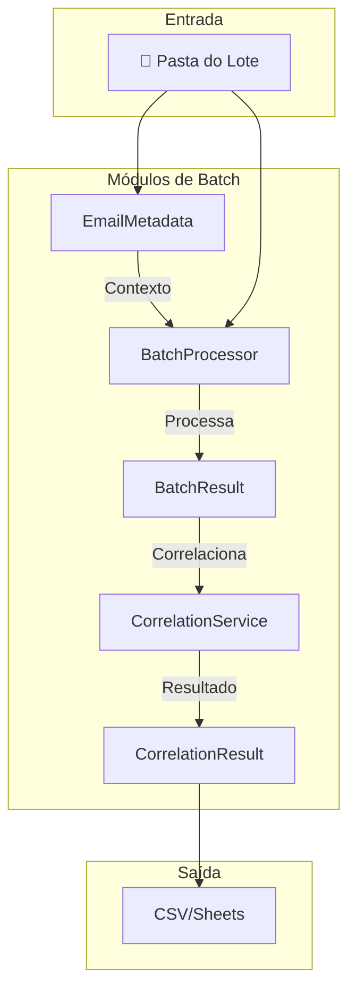
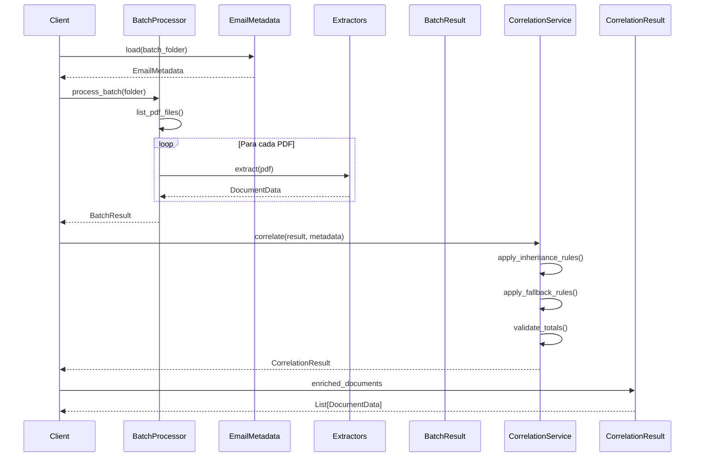

# Batch Processing - Documentação Técnica

Esta seção documenta os módulos de processamento em lote introduzidos na v0.2.x.

## Visão Geral

O sistema de batch processing permite processar múltiplos documentos de um mesmo e-mail como uma unidade, habilitando correlação entre DANFE e Boleto.



---

## Módulos

### EmailMetadata (`core/metadata.py`)

Classe para gerenciar metadados do e-mail de origem.

**Responsabilidades:**

- Carregar/salvar `metadata.json` de uma pasta de lote
- Extrair CNPJ do corpo do e-mail
- Extrair número de pedido do assunto/corpo
- Fornecer fallbacks para campos ausentes

#### Atributos

| Atributo               | Tipo            | Descrição                        |
| :--------------------- | :-------------- | :------------------------------- |
| `batch_id`             | `str`           | Identificador único do lote      |
| `email_subject`        | `Optional[str]` | Assunto do e-mail                |
| `email_sender_name`    | `Optional[str]` | Nome do remetente                |
| `email_sender_address` | `Optional[str]` | Endereço de e-mail do remetente  |
| `email_body_text`      | `Optional[str]` | Corpo do e-mail em texto plano   |
| `received_date`        | `Optional[str]` | Data de recebimento (ISO 8601)   |
| `attachments`          | `List[str]`     | Lista de nomes dos anexos        |
| `created_at`           | `str`           | Timestamp de criação do metadata |

#### Métodos

```python
from core.metadata import EmailMetadata
from pathlib import Path

# Carregar de pasta existente
metadata = EmailMetadata.load(Path("temp_email/email_123"))

# Criar novo
metadata = EmailMetadata.create_for_batch(
    batch_id="email_123",
    subject="[NF] Nota Fiscal #12345 - Fornecedor LTDA",
    sender_name="Fornecedor LTDA",
    sender_address="nf@fornecedor.com.br",
    body_text="Segue em anexo a NF 12345. CNPJ: 12.345.678/0001-90"
)

# Salvar em pasta
metadata.save(Path("temp_email/email_123"))

# Extrair dados do contexto
cnpj = metadata.extract_cnpj_from_body()          # "12.345.678/0001-90"
pedido = metadata.extract_numero_pedido_from_context()  # "12345"
fornecedor = metadata.get_fallback_fornecedor()   # "Fornecedor LTDA"

# Novos métodos de extração de contexto
link_nfe = metadata.extract_link_nfe_from_context() # "https://nfe.prefeitura.sp.gov.br/..."
codigo = metadata.extract_codigo_verificacao_from_link(link_nfe) # "BTE1S3EG"
fornecedor_email = metadata.extract_fornecedor_from_context() # "Nome do Fornecedor"
vencimento_email = metadata.extract_vencimento_from_context() # "15/01/2025"
```

::: core.metadata.EmailMetadata
options:
show_root_heading: true
show_source: false

---

### BatchProcessor (`core/batch_processor.py`)

Processador de lotes que substitui o loop de arquivos individual.

**Responsabilidades:**

- Processar uma pasta de lote como unidade
- Priorizar arquivos XML quando completos, usando PDFs como fallback.
- Detectar tipo de cada documento (DANFE, Boleto, NFSe, Outros)
- Rotear para extrator apropriado
- Agregar resultados em `BatchResult`

#### Uso Básico

```python
from core.batch_processor import BatchProcessor, process_email_batch
from pathlib import Path

# Forma simples (função helper)
result = process_email_batch("temp_email/email_123")

# Forma completa (com configuração)
processor = BatchProcessor()

# Processar um lote
result = processor.process_batch(Path("temp_email/email_123"))

# Processar múltiplos lotes
results = processor.process_multiple_batches(Path("temp_email/"))

# Processar arquivos legados (sem metadata.json)
result = processor.process_legacy_files(Path("failed_cases_pdf/"))
```

#### Configuração

```python
from core.batch_processor import BatchProcessor
from strategies.fallback import SmartExtractionStrategy

# Injetar estratégia customizada
strategy = SmartExtractionStrategy()
processor = BatchProcessor(text_strategy=strategy)
```

::: core.batch_processor.BatchProcessor
options:
show_root_heading: true
show_source: false
members: - process_batch - process_multiple_batches - process_legacy_files

---

### BatchResult (`core/batch_result.py`)

Estrutura de resultado do processamento em lote.

**Responsabilidades:**

- Armazenar documentos extraídos por tipo
- Calcular totais e estatísticas
- Gerar resumo do lote

#### Atributos

| Atributo   | Tipo                      | Descrição                       |
| :--------- | :------------------------ | :------------------------------ |
| `batch_id` | `str`                     | ID do lote processado           |
| `danfes`   | `List[DanfeData]`         | DANFEs extraídas                |
| `boletos`  | `List[BoletoData]`        | Boletos extraídos               |
| `nfses`    | `List[InvoiceData]`       | NFSes extraídas                 |
| `outros`   | `List[OtherDocumentData]` | Outros documentos               |
| `errors`   | `List[str]`               | Erros durante processamento     |
| `metadata` | `Optional[EmailMetadata]` | Metadados do e-mail (se houver) |

#### Propriedades

```python
result.has_danfe       # True se tem pelo menos uma DANFE
result.has_boleto      # True se tem pelo menos um Boleto
result.has_nfse        # True se tem pelo menos uma NFSe
result.all_documents   # Lista unificada de todos os documentos
result.document_count  # Total de documentos processados
```

#### Métodos

```python
from core.batch_result import BatchResult

# Calcular totais
valor_lote = result.get_valor_total_lote()        # Soma de todos
valor_danfes = result.get_valor_total_danfes()    # Soma só das DANFEs
valor_boletos = result.get_valor_total_boletos()  # Soma só dos Boletos

# Gerar resumo (LEGADO)
# Este método gera um resumo único para o lote inteiro.
# Foi substituído por to_summaries() para lidar com múltiplas NFs.
summary_legacy = result.to_summary()

# Gerar resumos por par (RECOMENDADO)
# Usa o DocumentPairingService para separar cada transação (NF+Boleto)
# em um resumo individual.
summaries = result.to_summaries()
for summary in summaries:
    print(f"Resumo do Par {summary['numero_nota']}: {summary['status_conciliacao']}")
```

::: core.batch_result.BatchResult
options:
show_root_heading: true
show_source: false

---

### CorrelationService (`core/correlation_service.py`)

Serviço de correlação entre documentos do mesmo lote.

**Responsabilidades:**

- Vincular Boleto à Nota Fiscal correspondente
- Herdar campos entre documentos (vencimento, numero_nota)
- Validar consistência (soma de valores)
- Atribuir status de conciliação

#### Regras Implementadas

##### Regra 1: Herança de Dados

| Condição       | Campo Faltando           | Herda De |
| :------------- | :----------------------- | :------- |
| DANFE + Boleto | Boleto sem `numero_nota` | DANFE    |
| DANFE + Boleto | DANFE sem `vencimento`   | Boleto   |
| NFSe + Boleto  | Boleto sem `numero_nota` | NFSe     |
| NFSe + Boleto  | NFSe sem `vencimento`    | Boleto   |

##### Regra 2: Fallback de Identificação

| Campo Faltando    | Fallback                           |
| :---------------- | :--------------------------------- |
| `fornecedor_nome` | `email_sender_name` do metadata    |
| `cnpj`            | CNPJ extraído do `email_body_text` |
| `numero_pedido`   | Extraído do assunto/corpo          |

##### Regra 3: Validação Cruzada

| Situação                    | Status       |
| :-------------------------- | :----------- |
| Valor DANFE = Valor Boletos | `OK`         |
| Valor DANFE ≠ Valor Boletos | `DIVERGENTE` |
| Só Boleto (sem nota)        | `ORFAO`      |

#### Uso

```python
from core.correlation_service import CorrelationService, correlate_batch
from core.batch_processor import process_email_batch
from core.metadata import EmailMetadata
from pathlib import Path

# Processar lote
batch_result = process_email_batch("temp_email/email_123")
metadata = EmailMetadata.load(Path("temp_email/email_123"))

# Forma simples (função helper)
correlation = correlate_batch(batch_result, metadata)

# Forma completa
service = CorrelationService()
correlation = service.correlate(batch_result, metadata)

# Acessar resultado
print(f"Status: {correlation.status}")           # "OK", "DIVERGENTE", "ORFAO"
print(f"Divergência: {correlation.divergencia}") # Descrição do problema
print(f"Vencimento herdado: {correlation.vencimento_herdado}")
print(f"Número NF herdado: {correlation.numero_nota_herdado}")

# Documentos enriquecidos
for doc in correlation.enriched_documents:
    print(f"{doc.arquivo_origem}: {doc.status_conciliacao}")
```

#### CorrelationResult

| Atributo                | Tipo                 | Descrição                                                                       |
| :---------------------- | :------------------- | :------------------------------------------------------------------------------ |
| `status`                | `str`                | OK, DIVERGENTE ou CONFERIR                                                      |
| `divergencia`           | `Optional[str]`      | Descrição do problema ou alerta (ex: "sem boleto", "vencimento não encontrado") |
| `vencimento_herdado`    | `Optional[str]`      | Vencimento copiado do boleto para a nota                                        |
| `numero_nota_herdado`   | `Optional[str]`      | Número da NF copiado da nota para o boleto                                      |
| `numero_pedido_herdado` | `Optional[str]`      | Número do pedido herdado entre documentos                                       |
| `numero_nota_fonte`     | `Optional[str]`      | Fonte do número da nota herdado ('documento', 'email')                          |
| `sem_vencimento`        | `bool`               | Flag que indica se o lote ficou sem vencimento                                  |
| `vencimento_alerta`     | `Optional[str]`      | Data de alerta quando vencimento não é encontrado                               |
| `valor_total_lote`      | `float`              | **DEPRECATED**. Use `valor_compra` e `valor_boleto`.                            |
| `enriched_documents`    | `List[DocumentData]` | **DEPRECATED**. Os documentos no `BatchResult` já são enriquecidos.             |

::: core.correlation_service.CorrelationService
options:
show_root_heading: true
show_source: false
members: - correlate

::: core.correlation_service.CorrelationResult
options:
show_root_heading: true
show_source: false

---

### DocumentPairingService (`core/document_pairing.py`)

Serviço para parear múltiplos documentos NF↔Boleto dentro de um mesmo lote.

**Problema Resolvido:** E-mails com múltiplas notas (ex: 2 NFs + 2 Boletos) eram processados como uma única transação, causando divergência de valores. Este serviço separa cada transação em um "par" distinto.

**Responsabilidades:**

- Identificar e agrupar documentos duplicados (ex: XML e PDF da mesma nota).
- Parear NFs e Boletos pelo número da nota normalizado (ex: "2025/119" e "202500000000119" são considerados o mesmo).
- Usar o valor como fallback para pareamento quando não há número de nota (ex: faturas da Locaweb).
- Gerar um `DocumentPair` para cada transação, que é então usado para criar uma linha separada no relatório final.

#### Uso

```python
from core.document_pairing import pair_batch_documents
from core.batch_result import BatchResult

# Supondo que 'batch_result' é um objeto BatchResult com múltiplos documentos
pairs = pair_batch_documents(batch_result)

# 'pairs' é uma lista, onde cada item representa uma transação separada
for pair in pairs:
    print(f"Par: {pair.numero_nota}, Status: {pair.status}, Valor NF: {pair.valor_nf}")

# O método to_summaries() em BatchResult usa este serviço internamente
summaries = batch_result.to_summaries()
for summary in summaries:
    print(summary)
```

::: core.document_pairing.DocumentPairingService
options:
show_root_heading: true
show_source: false
members: - pair_documents

---

## Fluxo Completo



---

## Exemplos Completos

### Processar Lote Único

```python
from core.batch_processor import process_email_batch
from core.correlation_service import correlate_batch
from core.metadata import EmailMetadata
from pathlib import Path

# Caminho do lote
batch_folder = Path("temp_email/email_20251231_abc123")

# 1. Carregar metadata
metadata = EmailMetadata.load(batch_folder)
print(f"Assunto: {metadata.email_subject}")
print(f"Remetente: {metadata.email_sender_name}")

# 2. Processar documentos
result = process_email_batch(batch_folder)
print(f"Documentos: {result.document_count}")
print(f"DANFEs: {len(result.danfes)}")
print(f"Boletos: {len(result.boletos)}")

# 3. Correlacionar
correlation = correlate_batch(result, metadata)
print(f"Status: {correlation.status}")
print(f"Valor Total: R$ {correlation.valor_total_lote:.2f}")

# 4. Exportar
for doc in correlation.enriched_documents:
    row = doc.to_sheets_row()
    print(row)
```

### Processar Múltiplos Lotes

```python
from core.batch_processor import BatchProcessor
from core.correlation_service import CorrelationService
from core.metadata import EmailMetadata
from pathlib import Path

processor = BatchProcessor()
correlator = CorrelationService()

temp_dir = Path("temp_email")
all_results = []

for batch_folder in temp_dir.iterdir():
    if not batch_folder.is_dir():
        continue

    # Processar
    result = processor.process_batch(batch_folder)

    # Carregar metadata (se existir)
    try:
        metadata = EmailMetadata.load(batch_folder)
    except FileNotFoundError:
        metadata = None

    # Correlacionar
    correlation = correlator.correlate(result, metadata)
    all_results.append(correlation)

    print(f"{batch_folder.name}: {correlation.status}")

# Estatísticas
ok_count = sum(1 for r in all_results if r.status == "OK")
divergente_count = sum(1 for r in all_results if r.status == "DIVERGENTE")
orfao_count = sum(1 for r in all_results if r.status == "ORFAO")

print(f"\nResumo: {ok_count} OK, {divergente_count} DIVERGENTE, {orfao_count} ORFAO")
```

### Modo Legado (Sem Metadata)

```python
from core.batch_processor import BatchProcessor
from pathlib import Path

processor = BatchProcessor()

# Processar pasta de PDFs soltos (modo v0.1.x)
result = processor.process_legacy_files(Path("failed_cases_pdf"))

print(f"Processados: {result.document_count}")
for doc in result.all_documents:
    print(f"  - {doc.arquivo_origem}: R$ {doc.valor_total or doc.valor_documento}")
```

---

## Ver Também

- [Core](core.md) - Módulos base (processor, models)
- [Services](services.md) - Serviço de ingestão
- [Guia de Ingestão](../guide/ingestion.md) - Configuração e uso
- [Migração Batch](../development/MIGRATION_BATCH_PROCESSING.md) - Guia de migração v0.1.x → v0.2.x
