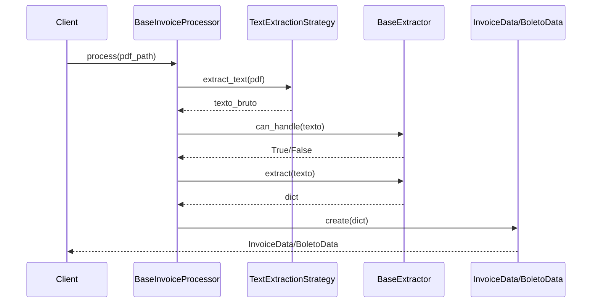

# Core - Módulos Centrais

Os módulos `core` contêm a lógica fundamental do sistema de processamento de documentos.

## Visão Geral

O pacote `core` é responsável por:

- **Orquestração**: Coordenação do pipeline completo de extração
- **Modelos de Dados**: Estruturas padronizadas (InvoiceData, BoletoData)
- **Interfaces**: Contratos para extensibilidade (Strategy Pattern)
- **Diagnósticos**: Sistema de análise de qualidade
- **Exceções**: Tratamento de erros customizado

## Módulos

### BaseInvoiceProcessor

Orquestrador principal que coordena todo o pipeline de processamento.

**Responsabilidades:**
- Receber PDF de entrada
- Selecionar estratégia de extração de texto apropriada
- Identificar tipo de documento (NFSe vs Boleto)
- Rotear para extrator especializado
- Retornar modelo de dados estruturado

::: core.processor.BaseInvoiceProcessor
    options:
      show_root_heading: true
      show_source: false
      members:
        - __init__
        - process
        - _select_strategy
        - _route_to_extractor

---

### Modelos de Dados

Estruturas de dados imutáveis usando `@dataclass`.

#### InvoiceData

Modelo para Notas Fiscais de Serviço Eletrônica (NFSe).

**Campos:**
- `arquivo_origem` (str): Nome do arquivo PDF original
- `texto_bruto` (str): Primeiros 500 caracteres do texto limpo (útil para debug/auditoria)
  - **Implementação:** Remove espaços/quebras primeiro, depois pega 500 chars
  - **Formato:** `' '.join(raw_text.split())[:500]`
- `cnpj_prestador` (Optional[str]): CNPJ do prestador formatado
- `numero_nota` (Optional[str]): Número da nota fiscal
- `data_emissao` (Optional[str]): Data no formato ISO (YYYY-MM-DD)
- `valor_total` (float): Valor total da nota

::: core.models.InvoiceData
    options:
      show_root_heading: true
      members_order: source

#### BoletoData

Modelo para Boletos Bancários.

**Campos:**
- `arquivo_origem` (str): Nome do arquivo PDF original
- `texto_bruto` (str): Primeiros 500 caracteres do texto limpo
  - **Implementação:** Remove espaços/quebras primeiro, depois pega 500 chars
  - **Formato:** `' '.join(raw_text.split())[:500]`
  - **Uso:** Debug, auditoria, treino de ML futuro
- `cnpj_beneficiario` (Optional[str]): CNPJ do beneficiário
- `valor_documento` (float): Valor nominal do boleto
- `vencimento` (Optional[str]): Data de vencimento (YYYY-MM-DD)
  - **Fallback:** Busca primeira data DD/MM/YYYY mesmo sem label "Vencimento:"
- `numero_documento` (Optional[str]): Número do documento
  - **Suporta:** Formato ano.número (ex: 2025.122) e 8 variações de padrão
- `linha_digitavel` (Optional[str]): Código de barras
- `nosso_numero` (Optional[str]): Identificação do banco
- `referencia_nfse` (Optional[str]): NFSe vinculada (se encontrado)

::: core.models.BoletoData
    options:
      show_root_heading: true
      members_order: source

---

### BaseExtractor

Classe abstrata base para todos os extratores de dados.

**Padrão de Design:** Template Method

**Métodos Abstratos:**
- `can_handle(text: str) -> bool`: Verifica se o extrator pode processar o documento
- `extract(text: str) -> Dict[str, Any]`: Extrai dados estruturados do texto

::: core.extractors.BaseExtractor
    options:
      show_root_heading: true
      show_source: false

---

### Interfaces

Contratos para implementação de componentes extensíveis.

#### TextExtractionStrategy

Interface para estratégias de extração de texto de PDFs.

**Implementações:**
- `NativePdfStrategy` - Usa PDFPlumber
- `TesseractOcrStrategy` - Usa OCR
- `SmartExtractionStrategy` - Fallback automático

::: core.interfaces.TextExtractionStrategy
    options:
      show_root_heading: true

#### EmailIngestorStrategy

Interface para conectores de entrada de dados.

**Implementações:**
- `ImapIngestor` - Servidor IMAP/Email

::: core.interfaces.EmailIngestorStrategy
    options:
      show_root_heading: true

---

### Exceções Customizadas

Hierarquia de exceções para tratamento de erros específicos do domínio.

::: core.exceptions
    options:
      show_root_heading: true

---

## Fluxo de Dados



## Exemplo de Uso

```python
from core.processor import BaseInvoiceProcessor
from core.models import InvoiceData, BoletoData

# Criar processador
processor = BaseInvoiceProcessor()

# Processar documento
result = processor.process("path/to/document.pdf")

# Verificar tipo
if isinstance(result, InvoiceData):
    print(f"NFSe #{result.numero_nota}: R$ {result.valor_total}")
elif isinstance(result, BoletoData):
    print(f"Boleto: R$ {result.valor_documento} - Venc: {result.vencimento}")
```

## Ver Também

- [Extractors](extractors.md) - Implementações de extratores
- [Strategies](strategies.md) - Estratégias de extração de texto
- [Diagnostics](diagnostics.md) - Sistema de análise de qualidade
