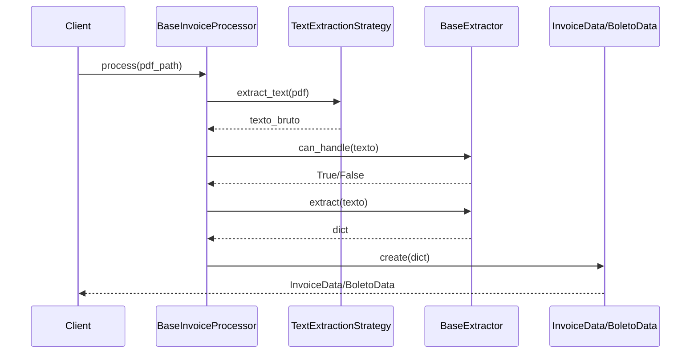

# Core - Módulos Centrais

Os módulos `core` contêm a lógica fundamental do sistema de processamento de documentos.

## Visão Geral

O pacote `core` é responsável por:

- **Orquestração**: Coordenação do pipeline completo de extração
- **Modelos de Dados**: Estruturas padronizadas (InvoiceData, BoletoData, DanfeData)
- **Batch Processing**: Processamento em lote com correlação (v0.2.x)
- **Google Sheets Export**: 🆕 Exportação para planilhas com duas abas (v0.3.x)
- **Interfaces**: Contratos para extensibilidade (Strategy Pattern)
- **Diagnósticos**: Sistema de análise de qualidade
- **Exceções**: Tratamento de erros customizado

## Módulos

### Módulos Base

#### BaseInvoiceProcessor

Orquestrador principal que coordena todo o pipeline de processamento.

**Responsabilidades:**

- Receber PDF de entrada
- Selecionar estratégia de extração de texto apropriada
- Identificar tipo de documento (NFSe vs Boleto)
- Rotear para extrator especializado
- Retornar modelo de dados estruturado

::: core.processor.BaseInvoiceProcessor
options:
show_root_heading: true
show_source: false
members: - process

---

### Modelos de Dados

Estruturas de dados imutáveis usando `@dataclass`.

#### DocumentData (Classe Base) 🆕

Classe abstrata base para todos os tipos de documento. Introduzida na v0.2.x para suportar batch processing.

**Campos Comuns (herdados por todos):**

| Campo                  | Tipo              | Descrição                                             |
| :--------------------- | :---------------- | :---------------------------------------------------- |
| `arquivo_origem`       | `str`             | Nome do arquivo PDF original                          |
| `texto_bruto`          | `str`             | Primeiros 500 caracteres do texto limpo               |
| `batch_id`             | `Optional[str]`   | 🆕 ID do lote de origem (ex: `email_20251231_abc123`) |
| `source_email_subject` | `Optional[str]`   | 🆕 Assunto do e-mail de origem                        |
| `source_email_sender`  | `Optional[str]`   | 🆕 Remetente do e-mail de origem                      |
| `valor_total_lote`     | `Optional[float]` | 🆕 Soma validada de todos os documentos do lote       |
| `status_conciliacao`   | `Optional[str]`   | 🆕 Status: `OK`, `DIVERGENTE` ou `ORFAO`              |

**Propriedades Abstratas:**

- `doc_type` - Retorna tipo do documento (`NFSE`, `BOLETO`, `DANFE`, `OUTROS`)
- `to_dict()` - Converte para dicionário
- `to_sheets_row()` - Converte para linha da planilha PAF (18 colunas)

**Métodos de Exportação (v0.3.x):**

- `to_anexos_row()` - 🆕 Converte para linha da aba 'anexos' (10 colunas)
- `to_sem_anexos_row()` - 🆕 Converte para linha da aba 'sem_anexos' (8 colunas)

#### InvoiceData

Modelo para Notas Fiscais de Serviço Eletrônica (NFSe).

**Campos:**

- `arquivo_origem` (str): Nome do arquivo PDF original
- `texto_bruto` (str): Primeiros 500 caracteres do texto limpo (útil para debug/auditoria)
    - **Implementação:** Remove espaços/quebras primeiro, depois pega 500 chars
    - **Formato:** `' '.join(raw_text.split())[:500]`
- `cnpj_prestador` (Optional[str]): CNPJ do prestador formatado
- `fornecedor_nome` (Optional[str]): Razão Social do prestador (coluna FORNECEDOR na planilha PAF)
- `numero_nota` (Optional[str]): Número da nota fiscal
- `data_emissao` (Optional[str]): Data no formato ISO (YYYY-MM-DD)
- `valor_total` (float): Valor total da nota
- `vencimento` (Optional[str]): Data de vencimento no formato ISO (YYYY-MM-DD)
- `dt_classificacao` (Optional[str]): Data de classificação no formato ISO (YYYY-MM-DD)
- `forma_pagamento` (Optional[str]): Forma de pagamento (PIX, TED, BOLETO)
- `tipo_doc_paf` (str): Tipo de documento para PAF (default: "NF")
- `trat_paf` (Optional[str]): Responsável pela classificação (coluna TRAT PAF)
- `lanc_sistema` (str): Status de lançamento no ERP (default: "PENDENTE")

::: core.models.InvoiceData
options:
show_root_heading: true
members_order: source

##### Método `to_anexos_row()` 🆕

Converte InvoiceData para linha da aba 'anexos' do Google Sheets.

```python
from core.models import InvoiceData

invoice = InvoiceData(
    arquivo_origem="nota.pdf",
    data_processamento="2026-01-09",
    empresa="CSC",
    fornecedor_nome="ACME LTDA",
    numero_nota="12345",
    valor_total=1500.50,
    vencimento="2026-01-15",
    source_email_subject="[FATURA] Nota Fiscal",
)

row = invoice.to_anexos_row()
# ['09/01/2026', '[FATURA] Nota Fiscal', '', 'CSC', '15/01/2026', 'ACME LTDA', '12345', 1500.5, 'OK', '[OK] | [URGENTE] Apenas 3 dias úteis até vencimento']
```

**Colunas retornadas (10):**

| Índice | Coluna     | Origem                            |
| :----- | :--------- | :-------------------------------- |
| 0      | DATA       | `data_processamento` (DD/MM/YYYY) |
| 1      | ASSUNTO    | `source_email_subject`            |
| 2      | N_PEDIDO   | Vazio (reservado)                 |
| 3      | EMPRESA    | `empresa`                         |
| 4      | VENCIMENTO | `vencimento` (DD/MM/YYYY)         |
| 5      | FORNECEDOR | `fornecedor_nome`                 |
| 6      | NF         | `numero_nota`                     |
| 7      | VALOR      | `valor_total`                     |
| 8      | SITUACAO   | Calculado automaticamente         |
| 9      | AVISOS     | Alertas concatenados              |

#### BoletoData

Modelo para Boletos Bancários.

**Campos:**

- `arquivo_origem` (str): Nome do arquivo PDF original
- `texto_bruto` (str): Primeiros 500 caracteres do texto limpo
    - **Implementação:** Remove espaços/quebras primeiro, depois pega 500 chars
    - **Formato:** `' '.join(raw_text.split())[:500]`
    - **Uso:** Debug, auditoria, treino de ML futuro
- `cnpj_beneficiario` (Optional[str]): CNPJ do beneficiário
- `fornecedor_nome` (Optional[str]): Razão Social do beneficiário (coluna FORNECEDOR na planilha PAF)
- `valor_documento` (float): Valor nominal do boleto
- `vencimento` (Optional[str]): Data de vencimento (YYYY-MM-DD)
    - **Fallback:** Busca primeira data DD/MM/YYYY mesmo sem label "Vencimento:"
- `dt_classificacao` (Optional[str]): Data de classificação no formato ISO (YYYY-MM-DD)
- `numero_documento` (Optional[str]): Número do documento
    - **Suporta:** Formato ano.número (ex: 2025.122) e 8 variações de padrão
- `linha_digitavel` (Optional[str]): Código de barras
- `nosso_numero` (Optional[str]): Identificação do banco
- `referencia_nfse` (Optional[str]): NFSe vinculada (se encontrado)
- `forma_pagamento` (Optional[str]): Forma de pagamento (default: "BOLETO")
- `tipo_doc_paf` (str): Tipo de documento para PAF (default: "BOLETO")
- `trat_paf` (Optional[str]): Responsável pela classificação
- `lanc_sistema` (str): Status de lançamento no ERP (default: "PENDENTE")

::: core.models.BoletoData
options:
show_root_heading: true
members_order: source

##### Método `to_anexos_row()` 🆕

Converte BoletoData para linha da aba 'anexos' do Google Sheets.

```python
from core.models import BoletoData

boleto = BoletoData(
    arquivo_origem="boleto.pdf",
    data_processamento="2026-01-09",
    empresa="MASTER",
    fornecedor_nome="FORNECEDOR LTDA",
    numero_documento="54321",
    valor_documento=750.00,
    vencimento="2026-01-10",
    source_email_subject="[URGENTE] Boleto vence amanha",
)

row = boleto.to_anexos_row()
# ['09/01/2026', '[URGENTE] Boleto vence amanha', '', 'MASTER', '10/01/2026', 'FORNECEDOR LTDA', '54321', 750.0, 'VENCIMENTO_PROXIMO', '[VENCIMENTO_PROXIMO] | [URGENTE] Apenas 1 dias úteis até vencimento']
```

**Nota:** Para boletos, `numero_documento` é usado na coluna NF e `valor_documento` na coluna VALOR.

---

### EmailAvisoData e Método `to_sem_anexos_row()` 🆕

O modelo `EmailAvisoData` representa e-mails sem anexo que contêm links para NF-e.

##### Método `to_sem_anexos_row()`

Converte EmailAvisoData para linha da aba 'sem_anexos' do Google Sheets.

```python
from core.models import EmailAvisoData

aviso = EmailAvisoData(
    arquivo_origem="email_123",
    data_processamento="2026-01-09",
    empresa="RBC",
    fornecedor_nome="Movidesk",
    numero_nota="193866",
    link_nfe="https://nfe.prefeitura.sp.gov.br/nfe.aspx?ccm=1234",
    codigo_verificacao="ABC123",
    email_subject_full="ENC: Movidesk - NFS-e + Boleto",
)

row = aviso.to_sem_anexos_row()
# ['09/01/2026', 'ENC: Movidesk - NFS-e + Boleto', '', 'RBC', 'Movidesk', '193866', 'https://nfe.prefeitura.sp.gov.br/nfe.aspx?ccm=1234', 'ABC123']
```

**Colunas retornadas (8):**

| Índice | Coluna     | Origem                                         |
| :----- | :--------- | :--------------------------------------------- |
| 0      | DATA       | `data_processamento` (DD/MM/YYYY)              |
| 1      | ASSUNTO    | `source_email_subject` ou `email_subject_full` |
| 2      | N_PEDIDO   | Vazio (reservado)                              |
| 3      | EMPRESA    | `empresa`                                      |
| 4      | FORNECEDOR | `fornecedor_nome`                              |
| 5      | NF         | `numero_nota`                                  |
| 6      | LINK       | `link_nfe`                                     |
| 7      | CÓDIGO     | `codigo_verificacao`                           |

---

### Função Auxiliar: `_calcular_situacao_vencimento()` 🆕

Função interna que calcula automaticamente a situação e avisos de um documento.

```python
from core.models import _calcular_situacao_vencimento

situacao, avisos = _calcular_situacao_vencimento(
    vencimento_str="2026-01-10",
    valor=1500.50,
    numero_nf="12345"
)
# situacao: "OK" ou "DIVERGENTE" ou "VENCIDO" ou "VENCIMENTO_PROXIMO" ou "CONFERIR"
# avisos: "[URGENTE] Apenas 2 dias úteis até vencimento"
```

**Regras de cálculo:**

| Condição                 | Situação             | Aviso                                          |
| :----------------------- | :------------------- | :--------------------------------------------- |
| NF ou VALOR faltando     | `DIVERGENTE`         | `[DIVERGENTE] Campos faltando: NF, VALOR`      |
| Vencimento passado       | `VENCIDO`            | `[VENCIDO] Vencimento em DD/MM/YYYY`           |
| Menos de 4 dias úteis    | `VENCIMENTO_PROXIMO` | `[URGENTE] Apenas X dias úteis até vencimento` |
| Vencimento não informado | `CONFERIR`           | `[CONFERIR] Vencimento não informado`          |
| Tudo OK                  | `OK`                 | -                                              |

!!! note "Cálculo de Dias Úteis"
Usa o calendário de São Paulo (`config/feriados_sp.py`) considerando feriados nacionais, estaduais e municipais.

---

### Módulos de Batch Processing

Introduzidos na v0.2.x para suportar processamento em lote com correlação.

#### EmailMetadata (`core/metadata.py`)

Gerencia metadados do e-mail de origem, carregados do arquivo `metadata.json`.

**Campos:**

| Campo                  | Tipo            | Descrição                       |
| :--------------------- | :-------------- | :------------------------------ |
| `batch_id`             | `str`           | Identificador único do lote     |
| `email_subject`        | `Optional[str]` | Assunto do e-mail               |
| `email_sender_name`    | `Optional[str]` | Nome do remetente               |
| `email_sender_address` | `Optional[str]` | Endereço de e-mail do remetente |
| `email_body_text`      | `Optional[str]` | Corpo do e-mail em texto plano  |
| `received_date`        | `Optional[str]` | Data de recebimento (ISO 8601)  |
| `attachments`          | `List[str]`     | Lista de nomes dos anexos       |

**Métodos de Extração:**

- `extract_cnpj_from_body()` - Extrai CNPJ do corpo do e-mail
- `extract_numero_pedido_from_context()` - Extrai número de pedido do assunto/corpo
- `get_fallback_fornecedor()` - Retorna nome do remetente como fallback

::: core.metadata.EmailMetadata
options:
show_root_heading: true
show_source: false

#### BatchProcessor (`core/batch_processor.py`)

Processa todos os documentos de uma pasta de lote como unidade.

**Métodos:**

- `process_batch(folder: Path) -> BatchResult` - Processa um lote
- `process_multiple_batches(temp_dir: Path) -> List[BatchResult]` - Processa múltiplos lotes
- `process_legacy_files(folder: Path) -> BatchResult` - Modo legado (sem metadata)

::: core.batch_processor.BatchProcessor
options:
show_root_heading: true
show_source: false

#### BatchResult (`core/batch_result.py`)

Estrutura de resultado do processamento de um lote.

**Propriedades:**

| Propriedade     | Tipo                      | Descrição                        |
| :-------------- | :------------------------ | :------------------------------- |
| `danfes`        | `List[DanfeData]`         | DANFEs extraídas                 |
| `boletos`       | `List[BoletoData]`        | Boletos extraídos                |
| `nfses`         | `List[InvoiceData]`       | NFSes extraídas                  |
| `outros`        | `List[OtherDocumentData]` | Outros documentos                |
| `has_danfe`     | `bool`                    | True se tem pelo menos uma DANFE |
| `has_boleto`    | `bool`                    | True se tem pelo menos um Boleto |
| `all_documents` | `List[DocumentData]`      | Lista unificada                  |

**Métodos:**

- `get_valor_total_lote()` - Soma de todos os valores
- `get_valor_total_danfes()` - Soma só das DANFEs
- `get_valor_total_boletos()` - Soma só dos Boletos
- `to_summary()` - Dicionário com resumo do lote

::: core.batch_result.BatchResult
options:
show_root_heading: true
show_source: false

#### CorrelationService (`core/correlation_service.py`)

Serviço de correlação e enriquecimento entre documentos do mesmo lote.

**Regras Implementadas:**

1. **Herança de Dados:**
    - Boleto herda `numero_nota` da DANFE
    - DANFE herda `vencimento` do Boleto

2. **Fallback de Identificação:**
    - `fornecedor_nome` vazio → usa `email_sender_name`
    - `cnpj` vazio → extrai do corpo do e-mail

3. **Validação Cruzada:**
    - Valor DANFE = Valor Boletos → Status `OK`
    - Valor DANFE ≠ Valor Boletos → Status `DIVERGENTE`
    - Só Boleto (sem nota) → Status `ORFAO`

::: core.correlation_service.CorrelationService
options:
show_root_heading: true
show_source: false

---

### BaseExtractor

Classe abstrata base para todos os extratores de dados.

**Padrão de Design:** Template Method

**Métodos Abstratos:**

- `can_handle(text: str) -> bool`: Verifica se o extrator pode processar o documento
- `extract(text: str) -> Dict[str, Any]`: Extrai dados estruturados do texto

::: core.extractors.BaseExtractor
options:
show_root_heading: true
show_source: false

---

### Interfaces

Contratos para implementação de componentes extensíveis.

#### TextExtractionStrategy

Interface para estratégias de extração de texto de PDFs.

**Implementações:**

- `NativePdfStrategy` - Usa PDFPlumber
- `TesseractOcrStrategy` - Usa OCR
- `SmartExtractionStrategy` - Fallback automático

::: core.interfaces.TextExtractionStrategy
options:
show_root_heading: true

#### EmailIngestorStrategy

Interface para conectores de entrada de dados.

**Implementações:**

- `ImapIngestor` - Servidor IMAP/Email

::: core.interfaces.EmailIngestorStrategy
options:
show_root_heading: true

---

### Exceções Customizadas

Hierarquia de exceções para tratamento de erros específicos do domínio.

::: core.exceptions
options:
show_root_heading: true

---

## Fluxo de Dados



## Exemplos de Uso

### Processamento Individual (v0.1.x - Legado)

```python
from core.processor import BaseInvoiceProcessor
from core.models import InvoiceData, BoletoData

# Criar processador
processor = BaseInvoiceProcessor()

# Processar documento
result = processor.process("path/to/document.pdf")

# Verificar tipo
if isinstance(result, InvoiceData):
    print(f"NFSe #{result.numero_nota}: R$ {result.valor_total}")
elif isinstance(result, BoletoData):
    print(f"Boleto: R$ {result.valor_documento} - Venc: {result.vencimento}")
```

### Processamento em Lote (v0.2.x - Recomendado)

```python
from core.batch_processor import process_email_batch
from core.correlation_service import correlate_batch
from core.metadata import EmailMetadata
from pathlib import Path

# Caminho do lote
batch_folder = Path("temp_email/email_20251231_abc123")

# 1. Carregar metadata
metadata = EmailMetadata.load(batch_folder)
print(f"Assunto: {metadata.email_subject}")
print(f"Remetente: {metadata.email_sender_name}")

# 2. Processar documentos
result = process_email_batch(batch_folder)
print(f"DANFEs: {len(result.danfes)}")
print(f"Boletos: {len(result.boletos)}")

# 3. Correlacionar (herança + validação)
correlation = correlate_batch(result, metadata)
print(f"Status: {correlation.status}")  # OK, DIVERGENTE ou ORFAO

# 4. Acessar documentos enriquecidos
for doc in correlation.enriched_documents:
    print(f"{doc.arquivo_origem}: {doc.status_conciliacao}")
```

### Usando Novos Campos de Contexto

```python
from core.models import BoletoData

# Após correlação, documentos têm campos de contexto preenchidos
boleto: BoletoData = correlation.enriched_documents[0]

print(f"Lote: {boleto.batch_id}")
print(f"E-mail: {boleto.source_email_subject}")
print(f"Remetente: {boleto.source_email_sender}")
print(f"Status: {boleto.status_conciliacao}")
print(f"Valor Total Lote: R$ {boleto.valor_total_lote:.2f}")
```

## Ver Também

- [Batch Processing](batch.md) - Documentação completa de batch processing
- [Services](services.md) - IngestionService
- [Extractors](extractors.md) - Implementações de extratores
- [Strategies](strategies.md) - Estratégias de extração de texto
- [Diagnostics](diagnostics.md) - Sistema de análise de qualidade
- [Migração Batch](../development/MIGRATION_BATCH_PROCESSING.md) - Guia de migração v0.1.x → v0.2.x
- [Exportação Google Sheets](../guide/google_sheets_export.md) - 🆕 Guia de exportação para planilhas (v0.3.x)
