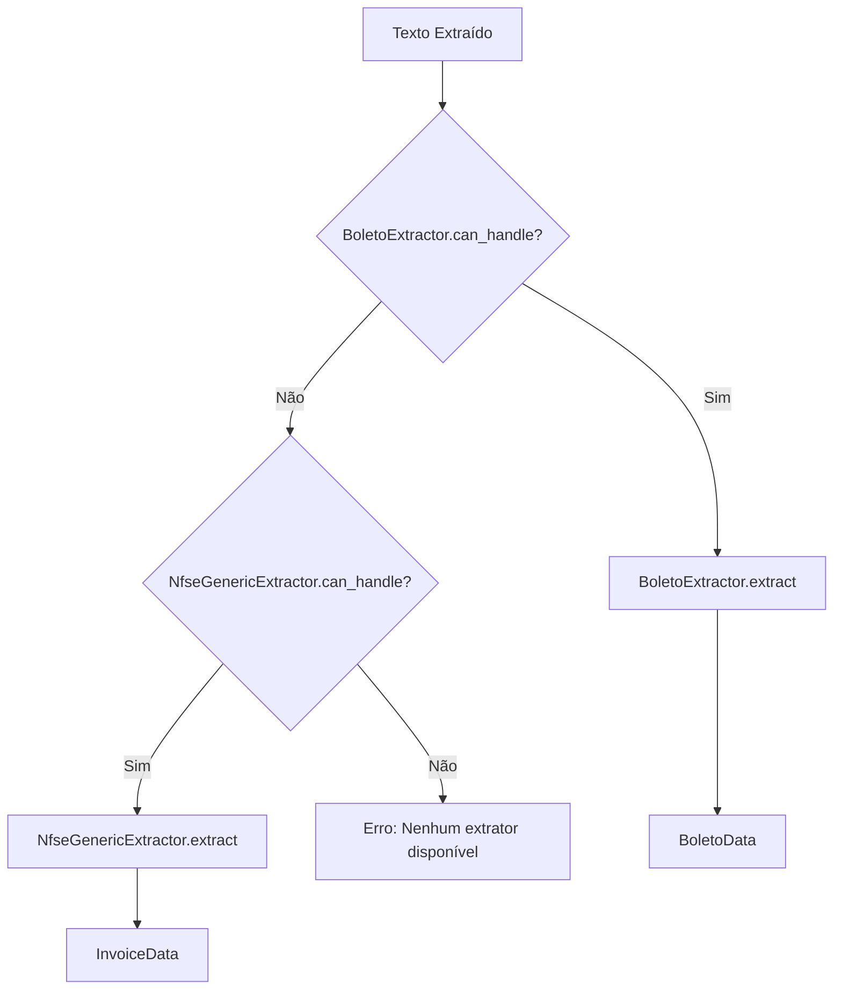

# Extractors - Extratores de Dados

Os extratores são responsáveis por interpretar o texto bruto e extrair campos específicos de diferentes tipos de documentos.

## Visão Geral

Cada extrator implementa a interface `BaseExtractor` e é especializado em um tipo de documento:

- **NfseGenericExtractor**: NFSe (fallback baseado em regex)
- **BoletoExtractor**: Boletos bancários (linha digitável, vencimento, etc.)

> Nota: o antigo `GenericExtractor` foi renomeado para `NfseGenericExtractor`.

**Padrão de Design:** Chain of Responsibility + Strategy

## NfseGenericExtractor

Extrator fallback para Notas Fiscais de Serviço Eletrônica usando expressões regulares.

### Características

- **Prefeituras suportadas**: Todas (fallback genérico)
- **Método de extração**: Regex patterns
- **Campos extraídos**:
  - CNPJ do Prestador
  - Número da Nota Fiscal
  - Data de Emissão
  - Valor Total

### Lógica de Identificação

O `NfseGenericExtractor` aceita qualquer documento que **não seja** um boleto bancário **nem DANFE** (Nota Fiscal Eletrônica de Produto).

**Indicadores de rejeição - Boletos:**

- Presença de "Linha Digitável"
- Palavras-chave: "Beneficiário", "Cedente", "Código de Barras"
- Padrão de linha digitável (5 blocos numéricos)

**Indicadores de rejeição - DANFE (Novo):**

- Palavra "DANFE" no documento
- Campos específicos de NFe produto: "CFOP", "ICMS", "Destinatário/Remetente"
- Verificação dupla: se contém "SERVIÇO" ou "NFS-e", ainda pode ser processado

### Regex Patterns

O extrator usa uma hierarquia de padrões regex ordenados por especificidade:

**Para Número da Nota:**

1. **Número da Nota com contexto explícito**: `"Número da Nota: XXXXX"`
2. **NFS-e específico**: `"NFS-e Nº XXXXX"`
3. **Nota Fiscal genérico**: `"Nota Fiscal Nº XXXXX"`
4. **Número isolado** (com filtros para evitar RPS/Lote/Série)

**Para Valor (Novo - Flexível):**

1. **Com R$ explícito**: `"Valor Total: R$ 1.234,56"`
2. **Sem R$ obrigatório**: `"Valor Total: 1.234,56"` (mais flexível)
3. **Variações**: "Valor da Nota", "Total Nota", "Valor Líquido"
4. **8 padrões ordenados** do mais específico ao mais genérico

### Limpeza de Texto

Antes da extração, o texto passa por limpeza:

- Remove datas (DD/MM/AAAA) para evitar confusão com números
- Remove identificadores auxiliares (RPS, Lote, Protocolo, Série)

::: extractors.nfse_generic.NfseGenericExtractor
    options:
      show_root_heading: true
      show_source: false

---

## BoletoExtractor

Extrator especializado em boletos bancários brasileiros.

### Características

- **Tipo de documento**: Boletos bancários
- **Método de extração**: Regex + Heurísticas avançadas (3 níveis de fallback)
- **Campos extraídos**:
  - CNPJ do Beneficiário
  - Valor do Documento (com múltiplos fallbacks)
  - Data de Vencimento
  - Número do Documento
  - Linha Digitável (código de barras)
  - Nosso Número
  - Referência à NFSe (se presente)

### Lógica de Identificação

O `BoletoExtractor` identifica boletos através de:

**Indicadores positivos (score):**

- "Linha Digitável" / "Linha Digitavel"
- "Beneficiário" / "Beneficiario"
- "Vencimento"
- "Valor do Documento"
- "Nosso Número"
- "Código de Barras"
- "Agência/Código"
- "Cedente"

**Critério de aceitação:**

- Score ≥ 3 palavras-chave **OU** padrão de linha digitável detectado
- **E** ausência de palavras-chave de NFSe

### Extração de Valor - 3 Níveis de Fallback (Novo)

#### Nível 1: Padrões Específicos

Busca por "Valor do Documento" com/sem R$:

```text
Valor do Documento: R$ 1.234,56
Valor do Documento
1.234,56
```

#### Nível 2: Heurística de Maior Valor

Se padrões específicos falharem, busca todos os valores monetários no documento e retorna o maior (geralmente o valor do documento é o maior valor em um boleto).

#### Nível 3: Extração da Linha Digitável

**Novo fallback crítico** para casos onde o texto está muito fragmentado:

- Extrai valor dos últimos 14 dígitos da linha digitável
- Formato: `XXXXX.XXXXX XXXXX.XXXXXX XXXXX.XXXXXX X [FFFF][VVVVVVVVVV]`
  - `FFFF` = Fator de vencimento (4 dígitos)
  - `VVVVVVVVVV` = Valor em centavos (10 dígitos)

**Exemplo:**

```text
Linha: 75691.31407 01130.051202 02685.970010 3 11690000625000
       └─────────────────────────────────┘ │ └────┘└────────┘
                    Campos                 │ Fator   Valor
                                           └─ DV

Valor extraído: 0000625000 centavos = R$ 6.250,00
```

### Campos Específicos

#### Linha Digitável

Formato padrão brasileiro:

```text
XXXXX.XXXXX XXXXX.XXXXXX XXXXX.XXXXXX X XXXXXXXXXXXXXX
```

#### Vencimento

Convertido automaticamente para formato ISO (YYYY-MM-DD).

**Padrões de extração (com fallback):**

1. **Com label explícito:**

   - `Vencimento: DD/MM/YYYY`
   - `Data de Vencimento: DD/MM/YYYY`

2. **Fallback - sem label:**

   - Busca primeira data no formato `DD/MM/YYYY`
   - Valida se o ano está entre 2024-2030 (datas futuras razoáveis)
   - Útil para PDFs com layout tabular onde label está distante

```python
# Exemplo de fallback
text = "Beneficiário: Empresa XYZ\n10/08/2025  R$ 1.250,00"
# Extrai "10/08/2025" mesmo sem label "Vencimento:"
```

#### Número do Documento

Campo desafiador devido à variedade de formatos e layouts.

**9 padrões implementados (ordem de prioridade):**

1. **⭐ Layout tabular com data:** `Nº Documento ... DD/MM/YYYY ... X/Y`

   - Pula data completa e captura número após (ex: "2/1" não "08")
   - Usa re.DOTALL para atravessar linhas
2-3. **Com label completo:** `Número do Documento: 12345` (variações de encoding `Nú`, `Nu`, `Nü`)
4-5. **Label abreviado:** `Nº Documento:`, `N. Documento:`, `Doc. Nº` (aceita `/` e `.`)
6-7. **Próximo a keywords:** Busca após "Vencimento" ou "Número"
2. **Formato ano.número:** `2025.122`, `2024.900` (comum em alguns bancos)
3. **Fallback inteligente:** Não captura datas (validação negativa)

**Exemplo - Layout tabular:**

```python
# PDF com layout:
# "Nº Documento  Espécie  Moeda  Valor"
# "08/11/2025    2/1      DM     R$ 4.789,00"

# Padrão r'(?i)N.?\s*Documento.*?\d{2}/\d{2}/\d{4}\s+(\d+/\d+)'
# com re.DOTALL captura "2/1" (pula a data "08/11/2025")
```

**Exemplo - Formato ano.número:**

```python
# PDF com layout:
# "Número do Documento"
# "2025.122"  (em linha separada)

# Padrão r'\b(20\d{2}\.\d+)\b' captura "2025.122"
```

**Desafios resolvidos:**

- ✅ Layout tabular (data antes do número)
- ✅ Encoding UTF-8 de "Número" (ú, ü)
- ✅ Label e valor em linhas separadas
- ✅ Formato ano.número (20XX.NNN)

#### Nosso Número

Identificação interna do banco, formato variável por instituição.

**Estratégia de extração em 3 níveis:**

1. **Com label + re.DOTALL**: Atravessa múltiplas linhas

   - `Nosso Número ... 109/00000507-1` (valor pode estar em linha diferente)
   - Padrão bancário específico: 2-3 dígitos / 7+ dígitos - dígito

2. **Com label (mesma linha)**: Formato simples

   - `Nosso Número: 26859-7`
   - Aceita qualquer formato com dígitos, hífens e barras

3. **⭐ Fallback sem label**: Para casos onde label é imagem OCR

   - Busca padrão `XXX/XXXXXXXX-X` isolado no texto
   - Ex: `109/42150105-8` (3 dígitos / 8 dígitos - 1 dígito)
   - **Evita falsos positivos**: Não captura Agência/Conta (4 dígitos) ou CNPJ (com pontos)

**Exemplo - Fallback genérico:**

```python
# PDF onde "Nosso Número" está como imagem:
# Texto: "...Yapay ... 2938 / 0053345-8 ... 109/42150105-8 ..."

# Padrão r'\b(\d{3}/\d{8}-\d)\b' captura "109/42150105-8"
# Ignora "2938 / 0053345-8" (4 dígitos antes da barra)
```

**Desafios resolvidos:**

- ✅ Label e valor em linhas separadas (re.DOTALL)
- ✅ Diferenciação de CNPJ (que tem pontos)
- ✅ Label renderizado como imagem (fallback genérico)
- ✅ Agência/Conta com 4 dígitos (formato diferente)

#### Referência à NFSe

Alguns boletos contêm referência à nota fiscal que os originou. O extrator tenta identificar:

- Padrão "NF 12345" ou "Nota 12345"
- Padrão "Referente à NFS-e XXXXX"

::: extractors.boleto.BoletoExtractor
    options:
      show_root_heading: true
      show_source: false

---

## Registro de Extratores

Os extratores são registrados automaticamente usando o decorator `@register_extractor`:

```python
from core.extractors import BaseExtractor, register_extractor

@register_extractor
class MeuExtrator(BaseExtractor):
    @classmethod
    def can_handle(cls, text: str) -> bool:
        # Lógica de identificação
        return "palavra-chave" in text.lower()
    
    def extract(self, text: str) -> Dict[str, Any]:
        # Lógica de extração
        return {"campo": "valor"}
```

O sistema automaticamente testa cada extrator registrado até encontrar um que aceite o documento.

---

## Fluxo de Roteamento



---

## Extensibilidade

Para adicionar suporte a um novo tipo de documento:

1. **Criar classe que herda de `BaseExtractor`**
2. **Implementar `can_handle()`** - Lógica de identificação
3. **Implementar `extract()`** - Lógica de extração
4. **Adicionar decorator `@register_extractor`**
5. **Criar modelo de dados** (se necessário)

### Exemplo: Extrator de Recibos

```python
from core.extractors import BaseExtractor, register_extractor
from dataclasses import dataclass

@dataclass
class ReciboData:
    arquivo_origem: str
    numero_recibo: str
    valor: float
    data: str

@register_extractor
class ReciboExtractor(BaseExtractor):
    @classmethod
    def can_handle(cls, text: str) -> bool:
        return "RECIBO" in text.upper() and "recebemos de" in text.lower()
    
    def extract(self, text: str) -> Dict[str, Any]:
        data = {}
        data['tipo_documento'] = 'RECIBO'
        data['numero_recibo'] = self._extract_numero(text)
        data['valor'] = self._extract_valor(text)
        return data
```

---

## Testes

Cada extrator possui testes unitários em [`tests/test_extractors.py`](../../tests/test_extractors.py):

```bash
python tests/test_extractors.py
```

**Cobertura de testes:**

- ✅ Identificação de tipo de documento (`can_handle`)
- ✅ Extração de campos individuais
- ✅ Integração com modelos de dados
- ✅ Edge cases (texto vazio, formatos inválidos)

---

## Ver Também

- [Core](core.md) - Classe base `BaseExtractor`
- [Strategies](strategies.md) - Extração de texto de PDFs
- [Diagnostics](diagnostics.md) - Validação de extrações
- [Guia de Testes](../guide/testing.md) - Como testar extratores
