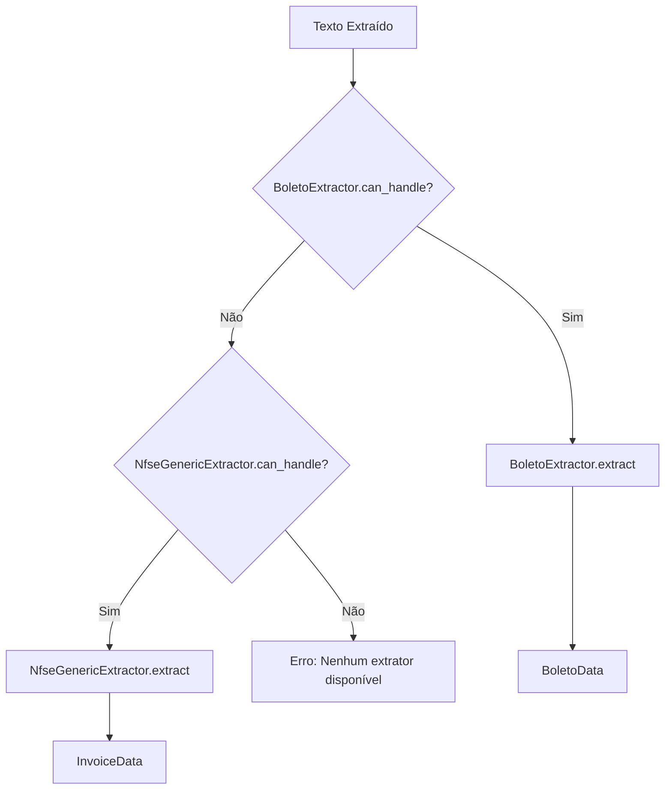

# Extractors - Extratores de Dados

Os extratores são responsáveis por interpretar o texto bruto e extrair campos específicos de diferentes tipos de documentos.

## Visão Geral

Cada extrator implementa a interface `BaseExtractor` e é especializado em um tipo de documento. O sistema utiliza um **registry** onde a **ordem de importação define a prioridade** de roteamento.

> Nota: o antigo `GenericExtractor` foi renomeado para `NfseGenericExtractor`.

**Padrão de Design:** Chain of Responsibility + Strategy

---

## Extratores Registrados (Ordem de Prioridade)

A ordem de importação em `extractors/__init__.py` define a prioridade. **Extratores específicos devem vir ANTES dos genéricos** para evitar classificação incorreta.

| #   | Extrator                            | Descrição                                                   | Tipo Documento |
| --- | ----------------------------------- | ----------------------------------------------------------- | -------------- |
| 1   | **BoletoRepromaqExtractor**         | Boletos REPROMAQ/Bradesco (evita catastrophic backtracking) | BOLETO         |
| 2   | **BoletoGoxExtractor**              | Boletos GOX S.A. específicos                                | BOLETO         |
| 3   | **EmcFaturaExtractor**              | Faturas EMC Tecnologia (multi-página)                       | OUTRO          |
| 4   | **NetCenterExtractor**              | NFSe específica Net Center                                  | NFSE           |
| 5   | **NfseCustomMontesClarosExtractor** | NFSe Montes Claros-MG                                       | NFSE           |
| 6   | **NfseCustomVilaVelhaExtractor**    | NFSe Vila Velha-ES                                          | NFSE           |
| 7   | **UtilityBillExtractor**            | Contas de utilidade (energia, água, gás)                    | OUTRO          |
| 8   | **NfcomTelcablesExtractor**         | NFCom/Telcables (faturas de telecom)                        | OUTRO          |
| 9   | **AcimocExtractor**                 | Boletos ACIMOC específicos                                  | BOLETO         |
| 10  | **MugoExtractor**                   | Faturas MUGO Telecom                                        | OUTRO          |
| 11  | **ProPainelExtractor**              | Faturas PRÓ - PAINEL LTDA                                   | OUTRO          |
| 12  | **TunnaFaturaExtractor**            | Faturas FishTV/Tunna                                        | OUTRO          |
| 13  | **UfinetExtractor**                 | Faturas Ufinet                                              | OUTRO          |
| 14  | **SabespWaterBillExtractor**        | Faturas de água Sabesp (via email body)                     | OUTRO          |
| 15  | **CscNotaDebitoExtractor**          | Nota Débito/Recibo Fatura CSC GESTÃO                        | OUTRO          |
| 16  | **AdminDocumentExtractor**          | Documentos administrativos (evita falsos positivos)         | OUTRO          |
| 17  | **ComprovanteBancarioExtractor**    | Comprovantes TED/PIX/DOC                                    | OUTRO          |
| 18  | **OcrDanfeExtractor**               | DANFEs com OCR corrompido (antes do DanfeExtractor)         | DANFE          |
| 19  | **DanfeExtractor**                  | DANFE/DF-e genérico                                         | DANFE          |
| 20  | **BoletoExtractor**                 | Boletos genéricos                                           | BOLETO         |
| 21  | **SicoobExtractor**                 | Boletos Sicoob                                              | BOLETO         |
| 22  | **AditivoContratoExtractor**        | Aditivos de contrato                                        | OUTRO          |
| 23  | **OutrosExtractor**                 | Documentos diversos (faturas, ordens de serviço)            | OUTRO          |
| 24  | **NfseGenericExtractor**            | NFSe genérico (fallback final)                              | NFSE           |

**Nota:** Além dos extratores acima, o sistema também inclui:

- **EmailBodyExtractor** - Extração de corpo de e-mail (chamado diretamente, não via registry)
- **XmlExtractor** - Extração de XMLs fiscais (chamado diretamente, não via registry)

---

## NfseGenericExtractor

Extrator fallback para Notas Fiscais de Serviço Eletrônica usando expressões regulares.

### Características

- **Prefeituras suportadas**: Todas (fallback genérico)
- **Método de extração**: Regex patterns
- **Campos extraídos**:
    - CNPJ do Prestador
    - Número da Nota Fiscal
    - Data de Emissão
    - Valor Total

### Lógica de Identificação

O `NfseGenericExtractor` aceita qualquer documento que **não seja** um boleto bancário **nem DANFE** (Nota Fiscal Eletrônica de Produto).

**Indicadores de rejeição - Boletos:**

- Presença de "Linha Digitável"
- Palavras-chave: "Beneficiário", "Cedente", "Código de Barras"
- Padrão de linha digitável (5 blocos numéricos)

**Indicadores de rejeição - DANFE (Novo):**

- Palavra "DANFE" no documento
- Campos específicos de NFe produto: "CFOP", "ICMS", "Destinatário/Remetente"
- Verificação dupla: se contém "SERVIÇO" ou "NFS-e", ainda pode ser processado

### Regex Patterns

O extrator usa uma hierarquia de padrões regex ordenados por especificidade:

**Para Número da Nota:**

1. **Número da Nota com contexto explícito**: `"Número da Nota: XXXXX"`
2. **NFS-e específico**: `"NFS-e Nº XXXXX"`
3. **Nota Fiscal genérico**: `"Nota Fiscal Nº XXXXX"`
4. **Número isolado** (com filtros para evitar RPS/Lote/Série)

**Para Valor (Novo - Flexível):**

1. **Com R$ explícito**: `"Valor Total: R$ 1.234,56"`
2. **Sem R$ obrigatório**: `"Valor Total: 1.234,56"` (mais flexível)
3. **Variações**: "Valor da Nota", "Total Nota", "Valor Líquido"
4. **8 padrões ordenados** do mais específico ao mais genérico

### Limpeza de Texto

Antes da extração, o texto passa por limpeza:

- Remove datas (DD/MM/AAAA) para evitar confusão com números
- Remove identificadores auxiliares (RPS, Lote, Protocolo, Série)

::: extractors.nfse_generic.NfseGenericExtractor
options:
show_root_heading: true
show_source: false

---

## BoletoExtractor

Extrator especializado em boletos bancários brasileiros.

### Características

- **Tipo de documento**: Boletos bancários
- **Método de extração**: Regex + Heurísticas avançadas (3 níveis de fallback)
- **Campos extraídos**:
    - CNPJ do Beneficiário
    - Valor do Documento (com múltiplos fallbacks)
    - Data de Vencimento
    - Número do Documento
    - Linha Digitável (código de barras)
    - Nosso Número
    - Referência à NFSe (se presente)

### Lógica de Identificação

O `BoletoExtractor` identifica boletos através de:

**Indicadores positivos (score):**

- "Linha Digitável" / "Linha Digitavel"
- "Beneficiário" / "Beneficiario"
- "Vencimento"
- "Valor do Documento"
- "Nosso Número"
- "Código de Barras"
- "Agência/Código"
- "Cedente"

**Critério de aceitação:**

- Score ≥ 3 palavras-chave **OU** padrão de linha digitável detectado
- **E** ausência de palavras-chave de NFSe

### Extração de Valor - 3 Níveis de Fallback (Novo)

#### Nível 1: Padrões Específicos

Busca por "Valor do Documento" com/sem R$:

```text
Valor do Documento: R$ 1.234,56
Valor do Documento
1.234,56
```

#### Nível 2: Heurística de Maior Valor

Se padrões específicos falharem, busca todos os valores monetários no documento e retorna o maior (geralmente o valor do documento é o maior valor em um boleto).

#### Nível 3: Extração da Linha Digitável

**Novo fallback crítico** para casos onde o texto está muito fragmentado:

- Extrai valor dos últimos 14 dígitos da linha digitável
- Formato: `XXXXX.XXXXX XXXXX.XXXXXX XXXXX.XXXXXX X [FFFF][VVVVVVVVVV]`
    - `FFFF` = Fator de vencimento (4 dígitos)
    - `VVVVVVVVVV` = Valor em centavos (10 dígitos)

**Exemplo:**

```text
Linha: 75691.31407 01130.051202 02685.970010 3 11690000625000
       └─────────────────────────────────┘ │ └────┘└────────┘
                    Campos                 │ Fator   Valor
                                           └─ DV

Valor extraído: 0000625000 centavos = R$ 6.250,00
```

### Campos Específicos

#### Linha Digitável

Formato padrão brasileiro:

```text
XXXXX.XXXXX XXXXX.XXXXXX XXXXX.XXXXXX X XXXXXXXXXXXXXX
```

#### Vencimento

Convertido automaticamente para formato ISO (YYYY-MM-DD).

**Padrões de extração (com fallback):**

1. **Com label explícito:**
    - `Vencimento: DD/MM/YYYY`
    - `Data de Vencimento: DD/MM/YYYY`

2. **Fallback - sem label:**
    - Busca primeira data no formato `DD/MM/YYYY`
    - Valida se o ano está entre 2024-2030 (datas futuras razoáveis)
    - Útil para PDFs com layout tabular onde label está distante

```python
# Exemplo de fallback
text = "Beneficiário: Empresa XYZ\n10/08/2025  R$ 1.250,00"
# Extrai "10/08/2025" mesmo sem label "Vencimento:"
```

#### Número do Documento

Campo desafiador devido à variedade de formatos e layouts.

**9 padrões implementados (ordem de prioridade):**

1. **⭐ Layout tabular com data:** `Nº Documento ... DD/MM/YYYY ... X/Y`
    - Pula data completa e captura número após (ex: "2/1" não "08")
    - Usa re.DOTALL para atravessar linhas
      2-3. **Com label completo:** `Número do Documento: 12345` (variações de encoding `Nú`, `Nu`, `Nü`)
      4-5. **Label abreviado:** `Nº Documento:`, `N. Documento:`, `Doc. Nº` (aceita `/` e `.`).
      6-7. **Próximo a keywords:** Busca após "Vencimento" ou "Número"

2. **Formato ano.número:** `2025.122`, `2024.900` (comum em alguns bancos)
3. **Fallback inteligente:** Não captura datas (validação negativa)

**Exemplo - Layout tabular:**

```python
# PDF com layout:
# "Nº Documento  Espécie  Moeda  Valor"
# "08/11/2025    2/1      DM     R$ 4.789,00"

# Padrão r'(?i)N.?\s*Documento.*?\d{2}/\d{2}/\d{4}\s+(\d+/\d+)'
# com re.DOTALL captura "2/1" (pula a data "08/11/2025")
```

**Exemplo - Formato ano.número:**

```python
# PDF com layout:
# "Número do Documento"
# "2025.122"  (em linha separada)

# Padrão r'\b(20\d{2}\.\d+)\b' captura "2025.122"
```

**Desafios resolvidos:**

- ✅ Layout tabular (data antes do número)
- ✅ Encoding UTF-8 de "Número" (ú, ü)
- ✅ Label e valor em linhas separadas
- ✅ Formato ano.número (20XX.NNN)

#### Nosso Número

Identificação interna do banco, formato variável por instituição.

**Estratégia de extração em 3 níveis:**

1. **Com label + re.DOTALL**: Atravessa múltiplas linhas
    - `Nosso Número ... 109/00000507-1` (valor pode estar em linha diferente)
    - Padrão bancário específico: 2-3 dígitos / 7+ dígitos - dígito

2. **Com label (mesma linha)**: Formato simples
    - `Nosso Número: 26859-7`
    - Aceita qualquer formato com dígitos, hífens e barras

3. **⭐ Fallback sem label**: Para casos onde label é imagem OCR
    - Busca padrão `XXX/XXXXXXXX-X` isolado no texto
    - Ex: `109/42150105-8` (3 dígitos / 8 dígitos - 1 dígito)
    - **Evita falsos positivos**: Não captura Agência/Conta (4 dígitos) ou CNPJ (com pontos)

**Exemplo - Fallback genérico:**

```python
# PDF onde "Nosso Número" está como imagem:
# Texto: "...Yapay ... 2938 / 0053345-8 ... 109/42150105-8 ..."

# Padrão r'\b(\d{3}/\d{8}-\d)\b' captura "109/42150105-8"
# Ignora "2938 / 0053345-8" (4 dígitos antes da barra)
```

**Desafios resolvidos:**

- ✅ Label e valor em linhas separadas (re.DOTALL)
- ✅ Diferenciação de CNPJ (que tem pontos)
- ✅ Label renderizado como imagem (fallback genérico)
- ✅ Agência/Conta com 4 dígitos (formato diferente)

#### Referência à NFSe

Alguns boletos contêm referência à nota fiscal que os originou. O extrator tenta identificar:

- Padrão "NF 12345" ou "Nota 12345"
- Padrão "Referente à NFS-e XXXXX"

::: extractors.boleto.BoletoExtractor
options:
show_root_heading: true
show_source: false

---

## Registro de Extratores

Os extratores são registrados automaticamente usando o decorator `@register_extractor`:

```python
from core.extractors import BaseExtractor, register_extractor

@register_extractor
class MeuExtrator(BaseExtractor):
    @classmethod
    def can_handle(cls, text: str) -> bool:
        # Lógica de identificação
        return "palavra-chave" in text.lower()

    def extract(self, text: str) -> Dict[str, Any]:
        # Lógica de extração
        return {"campo": "valor"}
```

O sistema automaticamente testa cada extrator registrado até encontrar um que aceite o documento.

---

## Fluxo de Roteamento



---

## Extensibilidade

Para adicionar suporte a um novo tipo de documento:

1. **Criar classe que herda de `BaseExtractor`**
2. **Implementar `can_handle()`** - Lógica de identificação
3. **Implementar `extract()`** - Lógica de extração
4. **Adicionar decorator `@register_extractor`**
5. **Criar modelo de dados** (se necessário)

### Exemplo: Extrator de Recibos

```python
from core.extractors import BaseExtractor, register_extractor
from dataclasses import dataclass

@dataclass
class ReciboData:
    arquivo_origem: str
    numero_recibo: str
    valor: float
    data: str

@register_extractor
class ReciboExtractor(BaseExtractor):
    @classmethod
    def can_handle(cls, text: str) -> bool:
        return "RECIBO" in text.upper() and "recebemos de" in text.lower()

    def extract(self, text: str) -> Dict[str, Any]:
        data = {}
        data['tipo_documento'] = 'RECIBO'
        data['numero_recibo'] = self._extract_numero(text)
        data['valor'] = self._extract_valor(text)
        return data
```

---

## Testes

Cada extrator possui testes unitários em [`tests/test_extractors.py`](../../tests/test_extractors.py):

```bash
python tests/test_extractors.py
```

**Cobertura de testes:**

- ✅ Identificação de tipo de documento (`can_handle`)
- ✅ Extração de campos individuais
- ✅ Integração com modelos de dados
- ✅ Edge cases (texto vazio, formatos inválidos)

---

## Ver Também

- [Core](core.md) - Classe base `BaseExtractor`
- [Strategies](strategies.md) - Extração de texto de PDFs
- [Diagnostics](diagnostics.md) - Validação de extrações
- [Guia de Testes](../guide/testing.md) - Como testar extratores

---

## DanfeExtractor

Extrator para Documento Auxiliar da Nota Fiscal Eletrônica (DANFE, NF-e modelo 55).

### Características

- **Tipo de documento**: DANFE (NF-e de produto)
- **Campos extraídos**:
    - Chave de Acesso (44 dígitos)
    - Número da Nota e Série
    - Data de Emissão
    - Valor Total da Nota
    - CNPJ e Nome do Emitente
    - Vencimento e Número da Fatura (extraído das duplicatas)
    - Número do Pedido

### Lógica de Identificação

O `DanfeExtractor` é ativado se o texto contém:

- A palavra "DANFE".
- A frase "DOCUMENTO AUXILIAR DA NOTA FISCAL ELETRONICA".
- Uma chave de acesso de 44 dígitos.

::: extractors.danfe.DanfeExtractor
options:
show_root_heading: true
show_source: false

---

## Extratores Customizados

Esta seção cobre extratores "cirúrgicos" criados para lidar com layouts específicos de fornecedores ou municípios que não são bem cobertos pelos extratores genéricos.

### BoletoRepromaqExtractor

Extrator especializado para boletos da **REPROMAQ** (Bradesco).

- **Problema Resolvido**: O extrator genérico de boletos tinha problemas de _catastrophic backtracking_ em regex com este layout.
- **Lógica de Identificação**: Ativado pela presença de "REPROMAQ" ou CNPJ específico.
- **Diferencial**: Regex otimizadas para evitar timeout em PDFs grandes.

### BoletoGoxExtractor

Extrator especializado para boletos da **GOX S.A.**

- **Problema Resolvido**: Layout específico não capturado corretamente pelo extrator genérico.
- **Lógica de Identificação**: Ativado pela presença de "GOX S.A." ou CNPJ específico.

### UtilityBillExtractor

Extrator unificado para **contas de utilidade** (energia, água, gás).

- **Problema Resolvido**: Unifica extração de contas de concessionárias que antes eram classificadas incorretamente.
- **Lógica de Identificação**: Detecta padrões de contas de luz (CEMIG, CPFL, etc.), água e gás.
- **Subtipos**: `ENERGY`, `WATER`, `GAS`
- **Campos Extraídos**: `valor_total`, `vencimento`, `fornecedor_nome`, `cnpj_fornecedor`, `numero_cliente`

### NfcomTelcablesExtractor

Extrator para **NFCom** (Nota Fiscal de Comunicação) da Telcables.

- **Problema Resolvido**: Faturas de telecom com layout específico.
- **Lógica de Identificação**: Ativado por "NFCOM" ou "TELCABLES".

### AcimocExtractor

Extrator para boletos da **ACIMOC**.

- **Problema Resolvido**: Layout específico de boletos ACIMOC.
- **Lógica de Identificação**: Ativado pela presença de "ACIMOC" no texto.

### MugoExtractor

Extrator para faturas da **MUGO Telecom**.

- **Problema Resolvido**: Faturas de telecom com layout próprio.
- **Lógica de Identificação**: Ativado por "MUGO" ou CNPJ específico.

### ProPainelExtractor

Extrator para faturas da **PRÓ - PAINEL LTDA**.

- **Problema Resolvido**: Faturas com layout específico.
- **Lógica de Identificação**: Ativado por "PRÓ" + "PAINEL" ou CNPJ.

### TunnaFaturaExtractor

Extrator para faturas da **Tunna/FishTV**.

- **Problema Resolvido**: Faturas de serviço de TV que eram classificadas como NFSe sem número.
- **Lógica de Identificação**: Ativado por "TUNNA" ou "FISHTV" ou CNPJ específico.
- **Campos Extraídos**: `numero_documento` (formato FAT/XXXXX), `valor_total`, `vencimento`

### UfinetExtractor

Extrator para faturas da **Ufinet**.

- **Problema Resolvido**: Faturas de infraestrutura de telecom.
- **Lógica de Identificação**: Ativado por "UFINET" ou CNPJ específico.

### SabespWaterBillExtractor

Extrator especializado para **faturas de água da Sabesp** via email body.

- **Problema Resolvido**: PDFs da Sabesp são protegidos por senha (CPF do titular). Este extrator extrai dados diretamente do corpo do e-mail HTML.
- **Lógica de Identificação**: Ativado pelo sender `*@sabesp.com.br` e assunto contendo "Sabesp" ou "fatura".
- **Campos Extraídos**: `valor_total`, `vencimento`, `numero_fornecimento`, `codigo_barras`, `unidade`
- **Nota**: Chamado pelo `BatchProcessor` quando PDF está encriptado.

### CscNotaDebitoExtractor

Extrator para **Nota Débito/Recibo Fatura** da CSC GESTÃO INTEGRADA.

- **Problema Resolvido**: Documentos CSC sendo classificados como "NFSe sem número".
- **Lógica de Identificação**: Ativado por "NOTA DÉBITO / RECIBO FATURA" ou "CSC GESTAO" ou CNPJ `38.323.227/0001-40`.
- **Campos Extraídos**: `numero_documento`, `valor_total`, `data_emissao`, `competencia`, `tomador`
- **Suporta OCR**: Tolera variações como "N O T A D É B I T O" (espaços entre letras).

### AdminDocumentExtractor

Extrator para **documentos administrativos** (evita falsos positivos).

- **Problema Resolvido**: Documentos internos como comunicados, avisos e circulares sendo classificados como NFSe.
- **Lógica de Identificação**: Detecta padrões administrativos (comunicado, aviso, circular, etc.) SEM valores fiscais.
- **Diferencial**: Marca documentos como `tipo_documento=OUTRO`, `subtipo=ADMINISTRATIVO`.

### ComprovanteBancarioExtractor

Extrator para **comprovantes bancários** (TED, PIX, DOC).

- **Problema Resolvido**: Comprovantes de transferência de valores altos (R$ 1.6M+) sendo classificados como NFSe.
- **Lógica de Identificação**: Detecta padrões de comprovante TED/PIX/DOC.
- **Campos Extraídos**: `valor_total`, `data_operacao`, `tipo_operacao`, `banco_origem`, `banco_destino`
- **CRÍTICO**: Deve vir antes dos genéricos para evitar classificação incorreta.

### OcrDanfeExtractor

Extrator para **DANFEs com OCR corrompido**.

- **Problema Resolvido**: DANFEs onde o OCR corrompeu a chave de acesso ou outros campos.
- **Lógica de Identificação**: Ativado quando detecta padrões de DANFE mas chave de acesso está corrompida.
- **Diferencial**: Usa heurísticas mais tolerantes para OCR ruim. Vem ANTES do `DanfeExtractor`.

### AditivoContratoExtractor

Extrator para **aditivos de contrato**.

- **Problema Resolvido**: Aditivos contratuais sendo classificados como documentos genéricos.
- **Lógica de Identificação**: Detecta "ADITIVO" + "CONTRATO" ou padrões similares.
- **Campos Extraídos**: `numero_contrato`, `numero_aditivo`, `valor_aditivo`, `vigencia`

### EmcFaturaExtractor

Extrator especializado para faturas de locação da **EMC Tecnologia**.

- **Problema Resolvido**: O extrator genérico capturava o valor do primeiro item em faturas de múltiplas páginas, em vez do valor total que fica na última página.
- **Lógica de Identificação**: Ativado se o documento contém "FATURA DE LOCAÇÃO" e "EMC TECNOLOGIA".
- **Diferencial**: Procura especificamente pelo padrão "TOTAL R$ XX.XXX,XX" no final do documento para garantir a captura do valor correto.

::: extractors.emc_fatura.EmcFaturaExtractor
options:
show_root_heading: true
show_source: false

### NetCenterExtractor

Extrator otimizado para boletos do provedor **Net Center Unaí**.

- **Problema Resolvido**: O extrator genérico capturava o label "CPF/CNPJ" como o nome do fornecedor.
- **Lógica de Identificação**: Ativado pela presença de "NETCENTER" ou seu CNPJ, junto com marcadores de boleto.
- **Diferencial**: É um extrator corretivo. Ele primeiro executa o `BoletoExtractor` genérico e depois **corrige** o campo `fornecedor_nome` para um valor fixo e aplica regex mais precisas para o layout específico da Net Center.

::: extractors.net_center.NetCenterExtractor
options:
show_root_heading: true
show_source: false

### SicoobExtractor

Extrator otimizado para boletos do banco **SICOOB/BANCOOB** (código 756).

- **Problema Resolvido**: Melhorar a identificação do nome do fornecedor (beneficiário), que frequentemente falhava no extrator genérico para este layout.
- **Lógica de Identificação**: Ativado pela presença das palavras "SICOOB" ou "BANCOOB", ou pelo código do banco "756".
- **Diferencial**: Assim como o da NetCenter, ele executa o `BoletoExtractor` genérico e depois aplica uma lógica de correção para o `fornecedor_nome`, buscando o texto entre "Beneficiário" e "Agência".

::: extractors.sicoob.SicoobExtractor
options:
show_root_heading: true
show_source: false

### NfseCustomVilaVelhaExtractor

Extrator específico para NFS-e da prefeitura de **Vila Velha - ES**.

- **Problema Resolvido**: O extrator genérico não conseguia extrair o número da nota e o valor total corretamente devido ao layout único da cidade.
- **Lógica de Identificação**: Ativado pela presença das palavras "VILA VELHA" e "PREFEITURA".
- **Diferencial**: Usa regex customizadas para o número da nota e o valor, e então delega para o `NfseGenericExtractor` para preencher os campos restantes (CNPJ, data de emissão, etc.).

::: extractors.nfse_custom_vila_velha.NfseCustomVilaVelhaExtractor
options:
show_root_heading: true
show_source: false

### NfseCustomMontesClarosExtractor

Extrator específico para NFS-e da prefeitura de **Montes Claros - MG**.

- **Problema Resolvido**: As notas desta cidade frequentemente contêm um número de nota canônico longo (ex: `202500000015059`) que o extrator genérico não capturava.
- **Lógica de Identificação**: Ativado pela presença de "MONTES CLAROS" ou do domínio "nota.montesclaros.mg.gov.br", garantindo que não se trata de um boleto.
- **Diferencial**: Sua principal função é usar regex que priorizam a busca por este número de nota longo e canônico, garantindo a identificação correta do documento.

::: extractors.nfse_custom_montes_claros.NfseCustomMontesClarosExtractor
options:
show_root_heading: true
show_source: false

### OutrosExtractor

Extrator para documentos recorrentes que **não são** NFSe, Boleto ou DANFE.

- **Problema Resolvido**: Evita que o `NfseGenericExtractor` classifique incorretamente documentos como faturas de locação ou demonstrativos.
- **Lógica de Identificação**: Ativado pela presença de palavras-chave como "FATURA DE LOCAÇÃO", "DEMONSTRATIVO", "LOCAÇÃO DE EQUIPAMENTOS".
- **Subtipos Suportados**:
    - `LOCACAO`: Demonstrativos e contratos de locação de equipamentos
    - `FATURA`: Faturas de serviços recorrentes (ex: Locaweb, provedores)
- **Campos Extraídos**: `fornecedor_nome`, `cnpj_fornecedor`, `valor_total`, `vencimento`, `data_emissao`

::: extractors.outros.OutrosExtractor
options:
show_root_heading: true
show_source: false

---

---

## XmlExtractor

Extrator especializado para arquivos **XML** de NF-e e NFS-e.

### Características

- **Tipo de arquivo**: XML (não PDF)
- **Confiabilidade**: Muito superior ao PDF (dados estruturados)
- **Formatos suportados**:
    - NF-e (Nota Fiscal Eletrônica de Produto) - Modelo 55
    - NFS-e (Nota Fiscal de Serviço Eletrônica) - Padrão ABRASF e variantes municipais

### Estrutura XML NF-e

```xml
<nfeProc>
    <NFe>
        <infNFe>
            <ide>...</ide>      <!-- Identificação (número, série, data) -->
            <emit>...</emit>    <!-- Emitente (CNPJ, razão social) -->
            <dest>...</dest>    <!-- Destinatário -->
            <total>...</total>  <!-- Valores totais -->
            <cobr>...</cobr>    <!-- Cobrança (duplicatas, vencimento) -->
        </infNFe>
    </NFe>
</nfeProc>
```

### Estrutura XML NFS-e (ABRASF)

```xml
<CompNfse>
    <Nfse>
        <InfNfse>
            <Numero>...</Numero>
            <PrestadorServico>...</PrestadorServico>
            <TomadorServico>...</TomadorServico>
            <Servico>...</Servico>
        </InfNfse>
    </Nfse>
</CompNfse>
```

### Quando Usar

✅ **Ideal para:**

- Arquivos XML anexados junto com PDFs
- Extração de dados fiscais com 100% de precisão
- Validação cruzada com dados extraídos de PDF

### XmlExtractionResult

Resultado da extração retornado pelo `XmlExtractor`:

| Campo      | Tipo                     | Descrição                                  |
| :--------- | :----------------------- | :----------------------------------------- |
| `success`  | `bool`                   | Se a extração foi bem-sucedida             |
| `document` | `Optional[DocumentData]` | Documento extraído (InvoiceData/DanfeData) |
| `doc_type` | `str`                    | Tipo: `NFE` ou `NFSE`                      |
| `error`    | `Optional[str]`          | Mensagem de erro, se houver                |
| `raw_data` | `Optional[Dict]`         | Dados brutos do XML parseado               |

::: extractors.xml_extractor.XmlExtractor
options:
show_root_heading: true
show_source: false
