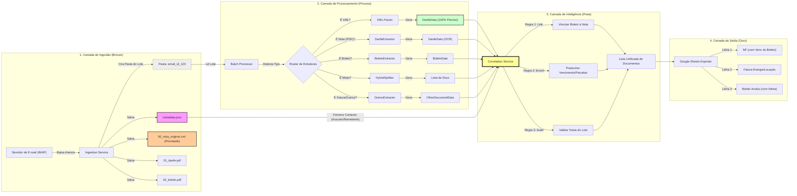
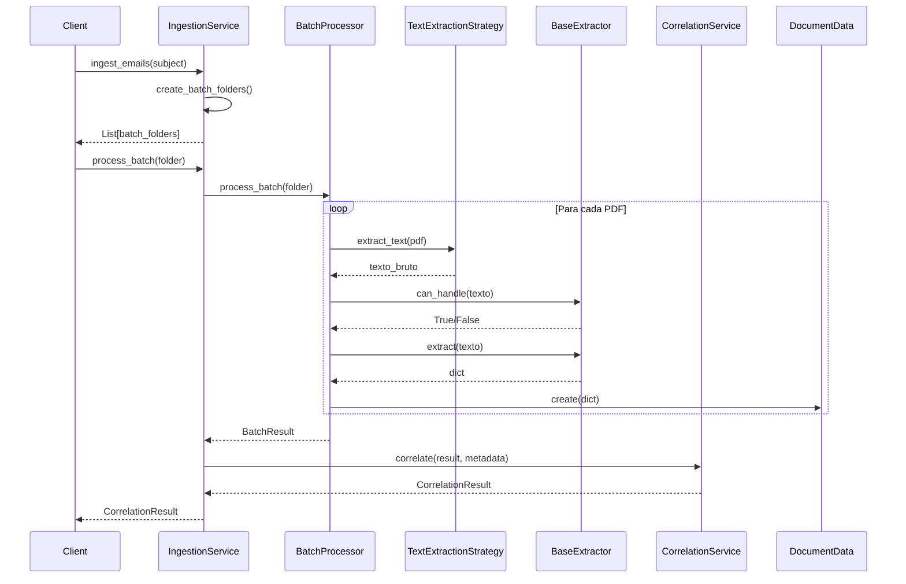

# API Reference - Visão Geral

## Arquitetura de Módulos (v0.2.x)

O projeto está organizado em camadas modulares seguindo princípios de Clean Architecture e SOLID:

```text
scrapper/
├── core/                       # Lógica central do negócio
│   ├── processor.py            # Orquestrador principal
│   ├── models.py               # Modelos de dados (InvoiceData, BoletoData, DanfeData)
│   ├── extractors.py           # Classe base e registry de extratores
│   ├── metadata.py             # 🆕 EmailMetadata (contexto do e-mail)
│   ├── batch_processor.py      # 🆕 BatchProcessor (processa lotes)
│   ├── batch_result.py         # 🆕 BatchResult (resultado de lote)
│   ├── correlation_service.py  # 🆕 CorrelationService (vinculação DANFE/Boleto)
│   ├── document_pairing.py     # 🆕 Pareamento de documentos (NF vs Boleto)
│   ├── diagnostics.py          # Sistema de análise de qualidade
│   ├── interfaces.py           # Interfaces e contratos
│   └── exceptions.py           # Exceções customizadas
│
├── services/                   # 🆕 Serviços de alto nível
│   └── ingestion_service.py    # Serviço de ingestão com lotes
│
├── extractors/                 # Extratores especializados
│   ├── nfse_generic.py         # Extração de NFSe genéricas
│   ├── boleto.py               # Extração de boletos bancários
│   ├── danfe.py                # Extração de DANFE
│   └── utils.py                # 🆕 Utilitários compartilhados
│
├── strategies/                 # Estratégias de extração de texto
│   ├── native.py               # PDFPlumber (rápido, nativo)
│   ├── ocr.py                  # Tesseract OCR (documentos escaneados)
│   └── fallback.py             # Combinação automática (fallback chain)
│
├── ingestors/                  # Conectores de entrada
│   ├── imap.py                 # Ingestão via e-mail IMAP
│   └── utils.py                # 🆕 Utilitários de ingestão
│
└── config/                     # Configurações
    └── settings.py             # Variáveis de ambiente e paths
```

## Módulos por Camada

### Core (`core/`)

**Lógica central de processamento e validação:**

| Módulo                   | Descrição                                            | Novidade |
| :----------------------- | :--------------------------------------------------- | :------: |
| `BaseInvoiceProcessor`   | Orquestrador que coordena o pipeline de extração     |          |
| `InvoiceData`            | Modelo para Notas Fiscais de Serviço (NFSe)          |          |
| `BoletoData`             | Modelo para Boletos Bancários                        |          |
| `DanfeData`              | Modelo para DANFE (NF-e)                             |          |
| `OtherDocumentData`      | Modelo para outros documentos (faturas, etc.)        |          |
| `EmailMetadata`          | Contexto do e-mail de origem (assunto, remetente)    |    🆕    |
| `BatchProcessor`         | Processador de lotes (pasta por e-mail)              |    🆕    |
| `BatchResult`            | Resultado agregado do processamento de um lote       |    🆕    |
| `CorrelationService`     | Vinculação e enriquecimento entre documentos do lote |    🆕    |
| `ExtractionDiagnostics`  | Sistema de análise de qualidade                      |          |
| `BaseExtractor`          | Classe abstrata base para todos os extratores        |          |
| `TextExtractionStrategy` | Interface para estratégias de extração de texto      |          |
| `EmailIngestorStrategy`  | Interface para conectores de entrada                 |          |

### Services (`services/`) 🆕

**Serviços de alto nível que orquestram múltiplos módulos:**

| Módulo             | Descrição                                              |
| :----------------- | :----------------------------------------------------- |
| `IngestionService` | Orquestra ingestão completa: e-mail → lote → resultado |

### Extractors (`extractors/`)

**Implementações especializadas para diferentes tipos de documentos:**

| Módulo                 | Descrição                                   |
| :--------------------- | :------------------------------------------ |
| `NfseGenericExtractor` | Fallback baseado em regex para NFSe         |
| `BoletoExtractor`      | Extrator especializado em boletos bancários |
| `DanfeExtractor`       | Extrator para DANFE (NF-e)                  |

### Strategies (`strategies/`)

**Implementação do padrão Strategy para extração de texto:**

| Módulo                    | Descrição                                             |
| :------------------------ | :---------------------------------------------------- |
| `NativePdfStrategy`       | Extração via PDFPlumber (rápida, documentos digitais) |
| `TesseractOcrStrategy`    | OCR via Tesseract (documentos escaneados/imagens)     |
| `SmartExtractionStrategy` | Fallback automático (native → OCR se falhar)          |

### Ingestors (`ingestors/`)

**Conectores para fontes de dados:**

| Módulo         | Descrição                                         |
| :------------- | :------------------------------------------------ |
| `ImapIngestor` | Conexão com servidor IMAP para download de anexos |

---

## Fluxo de Processamento (v0.2.x)



---

## Fluxo Detalhado por Módulo



---

## Documentação por Módulo

### Core (Núcleo)

::: core.processor.BaseInvoiceProcessor
options:
show_root_heading: true
show_source: false
members: - process

::: core.models.InvoiceData
options:
show_root_heading: true
members_order: source

::: core.models.BoletoData
options:
show_root_heading: true
members_order: source

::: core.diagnostics.ExtractionDiagnostics
options:
show_root_heading: true
show_source: false
members: - classificar_nfse - classificar_boleto - gerar_relatorio_texto - diagnosticar_tipo_falha

### Batch Processing 🆕

::: core.metadata.EmailMetadata
options:
show_root_heading: true
show_source: false

::: core.batch_processor.BatchProcessor
options:
show_root_heading: true
show_source: false
members: - process_batch - process_multiple_batches

::: core.batch_result.BatchResult
options:
show_root_heading: true
show_source: false

::: core.correlation_service.CorrelationService
options:
show_root_heading: true
show_source: false
members: - correlate

### Services 🆕

::: services.ingestion_service.IngestionService
options:
show_root_heading: true
show_source: false
members: - ingest_emails - process_batch - cleanup_old_batches

### Extractors

::: extractors.nfse_generic.NfseGenericExtractor
options:
show_root_heading: true
show_source: false
members: - can_handle - extract

::: extractors.boleto.BoletoExtractor
options:
show_root_heading: true
show_source: false
members: - can_handle - extract

### Strategies

::: strategies.native.NativePdfStrategy
options:
show_root_heading: true
show_source: false

::: strategies.ocr.TesseractOcrStrategy
options:
show_root_heading: true
show_source: false

::: strategies.fallback.SmartExtractionStrategy
options:
show_root_heading: true
show_source: false

### Ingestors

::: ingestors.imap.ImapIngestor
options:
show_root_heading: true
show_source: false

### Interfaces e Exceções

::: core.interfaces.TextExtractionStrategy
options:
show_root_heading: true

::: core.interfaces.EmailIngestorStrategy
options:
show_root_heading: true

::: core.exceptions
options:
show_root_heading: true

---

## Scripts Utilitários

Ferramentas de linha de comando para diagnóstico e manutenção:

| Script                         | Descrição                                     | Modo           |
| :----------------------------- | :-------------------------------------------- | :------------- |
| `validate_extraction_rules.py` | Valida regras de extração em PDFs de teste    | Legacy + Batch |
| `example_batch_processing.py`  | 🆕 Exemplos de processamento em lote          | Batch          |
| `inspect_pdf.py`               | 🆕 Inspeção rápida de PDFs (busca automática) | Legacy + Batch |
| `test_docker_setup.py`         | Testa setup Docker/Tesseract                  | Setup          |

---

## Quick Links

- [🏗️ Core (Núcleo)](core.md) - Processor, Models, Interfaces
- [📦 Batch Processing](batch.md) - 🆕 BatchProcessor, CorrelationService
- [⚙️ Services](services.md) - 🆕 IngestionService
- [⛏️ Extractors](extractors.md) - Extratores especializados
- [📖 Strategies](strategies.md) - Estratégias de extração
- [📊 Diagnostics](diagnostics.md) - Sistema de qualidade

---

## Exemplos de Uso

### Processamento Simples (v0.1.x - Legado)

```python
from core.processor import BaseInvoiceProcessor
from core.models import InvoiceData, BoletoData

# Criar processador
processor = BaseInvoiceProcessor()

# Processar documento individual
result = processor.process("path/to/document.pdf")

# Verificar tipo
if isinstance(result, InvoiceData):
    print(f"NFSe #{result.numero_nota}: R$ {result.valor_total}")
elif isinstance(result, BoletoData):
    print(f"Boleto: R$ {result.valor_documento} - Venc: {result.vencimento}")
```

### Processamento em Lote (v0.2.x - Recomendado)

```python
from services.ingestion_service import IngestionService
from ingestors.imap import ImapIngestor

# Configurar serviço
service = IngestionService(ImapIngestor())

# Ingerir e-mails
folders = service.ingest_emails(subject_filter="Nota Fiscal")

# Processar cada lote com correlação
for folder in folders:
    result = service.process_batch(folder, apply_correlation=True)
    print(f"{folder.name}: {result.status}")

    for doc in result.enriched_documents:
        print(f"  - {doc.arquivo_origem}: R$ {doc.valor_total or doc.valor_documento}")
```

### Correlação Manual

```python
from core.batch_processor import process_email_batch
from core.correlation_service import correlate_batch
from core.metadata import EmailMetadata
from pathlib import Path

# Processar lote
batch_folder = Path("temp_email/email_123")
result = process_email_batch(batch_folder)
metadata = EmailMetadata.load(batch_folder)

# Correlacionar
correlation = correlate_batch(result, metadata)

print(f"Status: {correlation.status}")
print(f"Valor Total: R$ {correlation.valor_total_lote:.2f}")

if correlation.divergencia:
    print(f"⚠️ {correlation.divergencia}")
```

---

## Ver Também

- [🚀 Guia de Uso](../guide/usage.md)
- [📧 Ingestão de E-mails](../guide/ingestion.md)
- [🔄 Migração Batch](../MIGRATION_BATCH_PROCESSING.md)
- [🧪 Testes Automatizados](../guide/testing.md)
- [🏗️ Arquitetura PDF Extraction](../research/architecture_pdf_extraction.md)
- [📈 Histórico de Refatorações](../development/refactoring_history.md)
