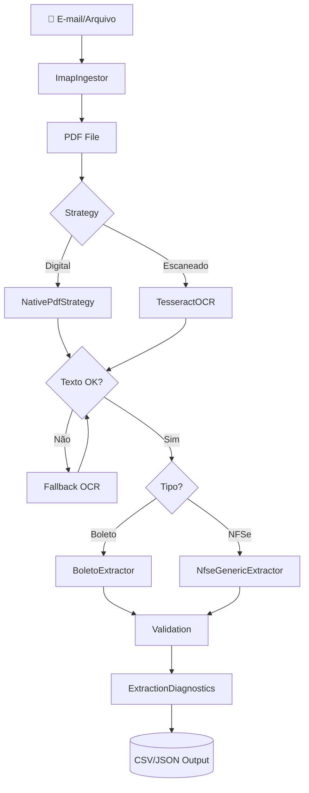

# API Reference - Visão Geral

## Arquitetura de Módulos

O projeto está organizado em camadas modulares seguindo princípios de Clean Architecture:

```text
scrapper/
├── core/           # Lógica central do negócio
│   ├── processor.py       # Orquestrador principal
│   ├── models.py          # Modelos de dados (InvoiceData, BoletoData)
│   ├── extractors.py      # Classe base para extratores
│   ├── diagnostics.py     # Sistema de análise de qualidade
│   ├── interfaces.py      # Interfaces e contratos
│   └── exceptions.py      # Exceções customizadas
│
├── extractors/     # Extratores especializados
│   ├── generic.py         # Extração de NFSe genéricas
│   └── boleto.py          # Extração de boletos bancários
│
├── strategies/     # Estratégias de extração de texto
│   ├── native.py          # PDFPlumber (rápido, nativo)
│   ├── ocr.py             # Tesseract OCR (documentos escaneados)
│   └── fallback.py        # Combinação automática (fallback chain)
│
├── ingestors/      # Conectores de entrada
│   └── imap.py            # Ingestão via e-mail IMAP
│
└── config/         # Configurações
    └── settings.py        # Variáveis de ambiente e paths
```

## Módulos Principais

### Core (`core/`)

**Lógica central de processamento e validação:**

- **`BaseInvoiceProcessor`** - Orquestrador que coordena todo o pipeline (extração → validação → output)
- **`InvoiceData`** - Modelo para Notas Fiscais de Serviço (NFSe)
- **`BoletoData`** - Modelo para Boletos Bancários
- **`ExtractionDiagnostics`** - Sistema de análise de qualidade e geração de relatórios
- **`BaseExtractor`** - Classe abstrata base para todos os extratores
- **`TextExtractionStrategy`** - Interface para estratégias de extração de texto
- **`EmailIngestorStrategy`** - Interface para conectores de entrada

::: core.processor.BaseInvoiceProcessor
    options:
      show_root_heading: true
      show_source: false
      members:
        - process

::: core.models.InvoiceData
    options:
      show_root_heading: true
      members_order: source

::: core.models.BoletoData
    options:
      show_root_heading: true
      members_order: source

::: core.diagnostics.ExtractionDiagnostics
    options:
      show_root_heading: true
      show_source: false
      members:
        - classificar_nfse
        - classificar_boleto
        - gerar_relatorio_texto
        - diagnosticar_tipo_falha

### Extractors (`extractors/`)

**Implementações especializadas para diferentes tipos de documentos:**

- **`NfseGenericExtractor`** - Fallback baseado em regex para NFSe (quando não há extrator específico)
- **`BoletoExtractor`** - Extrator especializado em boletos bancários (linha digitável, vencimento, valor)

 - **`NfseGenericExtractor`** - Fallback baseado em regex para NFSe (quando não há extrator específico)

::: extractors.nfse_generic.NfseGenericExtractor
    options:
      show_root_heading: true
      show_source: false
      members:
        - can_handle
        - extract

::: extractors.boleto.BoletoExtractor
    options:
      show_root_heading: true
      show_source: false
      members:
        - can_handle
        - extract

### Strategies (`strategies/`)

**Implementação do padrão Strategy para extração de texto:**

- **`NativePdfStrategy`** - Extração via PDFPlumber (rápida, documentos digitais)
- **`TesseractOcrStrategy`** - OCR via Tesseract (documentos escaneados/imagens)
- **`SmartExtractionStrategy`** - Fallback automático (native → OCR se falhar)

::: strategies.native.NativePdfStrategy
    options:
      show_root_heading: true
      show_source: false

::: strategies.ocr.TesseractOcrStrategy
    options:
      show_root_heading: true
      show_source: false

::: strategies.fallback.SmartExtractionStrategy
    options:
      show_root_heading: true
      show_source: false

### Ingestors (`ingestors/`)

**Conectores para fontes de dados:**

- **`ImapIngestor`** - Conexão com servidor IMAP para download de anexos PDF

::: ingestors.imap.ImapIngestor
    options:
      show_root_heading: true
      show_source: false

### Interfaces e Exceções

::: core.interfaces.TextExtractionStrategy
    options:
      show_root_heading: true

::: core.interfaces.EmailIngestorStrategy
    options:
      show_root_heading: true

::: core.exceptions
    options:
      show_root_heading: true

## Fluxo de Processamento



## Scripts Utilitários

Ferramentas de linha de comando para diagnóstico e manutenção:

- **`validate_extraction_rules.py`** - Valida regras de extração em PDFs de teste
- **`diagnose_failures.py`** - Analisa falhas no CSV de ingestão e gera relatório
- **`analyze_boletos.py`** - Análise estatística e vinculação de boletos com NFSe
- **`move_failed_files.py`** - Move arquivos com falha para pasta de análise

## Quick Links

- [🚀 Guia de Uso](guide/usage.md)
- [📧 Ingestão de E-mails](guide/ingestion.md)
- [🧪 Testes Automatizados](guide/testing.md)
- [🏗️ Arquitetura PDF Extraction](research/architecture_pdf_extraction.md)
- [📊 Insights de Desenvolvimento](research/insights.md)

## Exemplos de Uso

Para exemplos práticos e tutoriais completos, consulte a seção [Guia de Uso](guide/usage.md)
