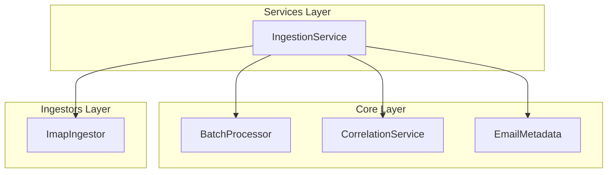
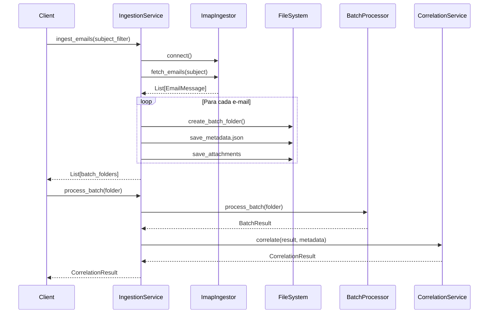

# Services - Documentação Técnica

Esta seção documenta os serviços de alto nível introduzidos na v2.x.

## Visão Geral

O pacote `services/` contém serviços que orquestram operações complexas envolvendo múltiplos módulos do sistema.



---

## IngestionService (`services/ingestion_service.py`)

Serviço de alto nível que orquestra o processo completo de ingestão de e-mails.

**Responsabilidades:**

- Conectar ao servidor de e-mail via ingestor
- Criar pastas de lote para cada e-mail
- Salvar anexos com numeração ordenada
- Gerar `metadata.json` com contexto do e-mail
- Processar lotes usando `BatchProcessor`
- Aplicar correlação via `CorrelationService`
- Gerenciar limpeza de lotes antigos

### Arquitetura



### Construtor

```python
from services.ingestion_service import IngestionService
from ingestors.imap import ImapIngestor
from pathlib import Path

# Configuração básica
ingestor = ImapIngestor()
service = IngestionService(ingestor)

# Configuração customizada
service = IngestionService(
    ingestor=ingestor,
    temp_dir=Path("temp_email"),       # Diretório para lotes
    auto_cleanup=False,                 # Desabilitar limpeza automática
    max_batch_age_hours=48              # Idade máxima dos lotes
)
```

### Métodos Principais

#### `ingest_emails(subject_filter: str) -> List[Path]`

Conecta ao servidor de e-mail, baixa mensagens e cria pastas de lote.

```python
from services.ingestion_service import IngestionService
from ingestors.imap import ImapIngestor

service = IngestionService(ImapIngestor())

# Ingerir e-mails com filtro de assunto
batch_folders = service.ingest_emails(subject_filter="Nota Fiscal")

print(f"Criados {len(batch_folders)} lotes:")
for folder in batch_folders:
    print(f"  - {folder.name}")
```

**Parâmetros:**

| Parâmetro        | Tipo  | Descrição                        |
| :--------------- | :---- | :------------------------------- |
| `subject_filter` | `str` | Filtro para buscar no assunto    |

**Retorno:** `List[Path]` - Lista de caminhos das pastas de lote criadas

---

#### `process_batch(batch_folder: Path, apply_correlation: bool = True) -> CorrelationResult`

Processa uma pasta de lote e aplica correlação entre documentos.

```python
from services.ingestion_service import IngestionService
from pathlib import Path

service = IngestionService(ingestor)

# Processar com correlação (padrão)
result = service.process_batch(Path("temp_email/email_123"))

# Processar sem correlação
result = service.process_batch(
    Path("temp_email/email_123"),
    apply_correlation=False
)

print(f"Status: {result.status}")
print(f"Documentos: {len(result.enriched_documents)}")
```

**Parâmetros:**

| Parâmetro           | Tipo   | Descrição                       |
| :------------------ | :----- | :------------------------------ |
| `batch_folder`      | `Path` | Caminho da pasta de lote        |
| `apply_correlation` | `bool` | Se deve aplicar correlação      |

**Retorno:** `CorrelationResult` - Resultado da correlação

---

#### `process_all_batches(apply_correlation: bool = True) -> List[CorrelationResult]`

Processa todos os lotes pendentes no diretório temporário.

```python
from services.ingestion_service import IngestionService

service = IngestionService(ingestor)

# Processar todos os lotes
results = service.process_all_batches()

# Estatísticas
ok = sum(1 for r in results if r.status == "OK")
divergente = sum(1 for r in results if r.status == "DIVERGENTE")
orfao = sum(1 for r in results if r.status == "ORFAO")

print(f"OK: {ok}, DIVERGENTE: {divergente}, ORFAO: {orfao}")
```

---

#### `cleanup_old_batches(max_age_hours: int = None) -> int`

Remove lotes mais antigos que o limite especificado.

```python
from services.ingestion_service import IngestionService

service = IngestionService(ingestor)

# Usar idade padrão (48 horas)
removed = service.cleanup_old_batches()

# Especificar idade customizada
removed = service.cleanup_old_batches(max_age_hours=24)

print(f"Removidos {removed} lotes antigos")
```

**Parâmetros:**

| Parâmetro       | Tipo  | Descrição                                      |
| :-------------- | :---- | :--------------------------------------------- |
| `max_age_hours` | `int` | Idade máxima em horas (default: 48)            |

**Retorno:** `int` - Número de lotes removidos

---

#### `reprocess_batches() -> List[CorrelationResult]`

Reprocessa todos os lotes existentes sem baixar novos e-mails.

```python
from services.ingestion_service import IngestionService

service = IngestionService(ingestor)

# Útil após atualizar regras de extração
results = service.reprocess_batches()

print(f"Reprocessados {len(results)} lotes")
```

---

### Fluxo Completo de Ingestão

```python
from services.ingestion_service import IngestionService
from ingestors.imap import ImapIngestor
from pathlib import Path
import os

# 1. Configurar ingestor (credenciais do .env)
ingestor = ImapIngestor(
    host=os.getenv("EMAIL_HOST"),
    user=os.getenv("EMAIL_USER"),
    password=os.getenv("EMAIL_PASS"),
    folder=os.getenv("EMAIL_FOLDER", "INBOX")
)

# 2. Criar serviço
service = IngestionService(
    ingestor=ingestor,
    temp_dir=Path("temp_email"),
    max_batch_age_hours=72
)

# 3. Ingerir e-mails
print("Buscando e-mails...")
batch_folders = service.ingest_emails(subject_filter="Nota Fiscal")
print(f"Encontrados {len(batch_folders)} e-mails com anexos")

# 4. Processar cada lote
all_results = []
for folder in batch_folders:
    print(f"\nProcessando {folder.name}...")
    result = service.process_batch(folder)
    all_results.append(result)
    
    print(f"  Status: {result.status}")
    print(f"  Documentos: {len(result.enriched_documents)}")
    if result.divergencia:
        print(f"  ⚠️ {result.divergencia}")

# 5. Exportar resultados
from core.models import DocumentData

output_rows = []
for result in all_results:
    for doc in result.enriched_documents:
        output_rows.append(doc.to_sheets_row())

# Salvar CSV
import csv
with open("data/output/relatorio_ingestao.csv", "w", newline="") as f:
    writer = csv.writer(f)
    # Escrever headers e rows...

# 6. Limpeza
removed = service.cleanup_old_batches()
print(f"\nLimpeza: {removed} lotes antigos removidos")
```

---

### Estrutura de Pastas Criada

Após `ingest_emails()`, a estrutura criada é:

```
temp_email/
├── email_20251231_abc123/
│   ├── metadata.json           # Contexto do e-mail
│   ├── 01_DANFE_12345.pdf      # Anexos numerados
│   ├── 02_boleto.pdf
│   └── ignored/                # Arquivos ignorados (imagens, etc)
│       └── logo.png
│
├── email_20251231_def456/
│   ├── metadata.json
│   └── 01_nota_fiscal.pdf
│
└── email_20251231_ghi789/
    ├── metadata.json
    ├── 01_NF-e.xml              # XMLs têm prioridade
    └── 02_DANFE.pdf
```

---

### Integração com CLI (`run_ingestion.py`)

O `IngestionService` é usado internamente pelo script de CLI:

```bash
# Ingestão padrão (usa IngestionService)
python run_ingestion.py

# Equivalente programático:
service = IngestionService(ingestor)
folders = service.ingest_emails(subject_filter="Nota Fiscal")
for folder in folders:
    service.process_batch(folder, apply_correlation=True)
```

---

### Configuração via Variáveis de Ambiente

| Variável                  | Descrição                       | Default     |
| :------------------------ | :------------------------------ | :---------- |
| `EMAIL_HOST`              | Servidor IMAP                   | -           |
| `EMAIL_USER`              | Usuário de e-mail               | -           |
| `EMAIL_PASS`              | Senha (App Password)            | -           |
| `EMAIL_FOLDER`            | Pasta a monitorar               | `INBOX`     |
| `INGESTION_TEMP_DIR`      | Diretório de lotes              | `temp_email`|
| `INGESTION_MAX_AGE_HOURS` | Idade máxima de lotes           | `48`        |

---

### Tratamento de Erros

```python
from services.ingestion_service import IngestionService
from core.exceptions import ConnectionError, ExtractionError

service = IngestionService(ingestor)

try:
    folders = service.ingest_emails("Nota Fiscal")
except ConnectionError as e:
    print(f"Erro de conexão IMAP: {e}")
    # Tentar reconectar ou notificar

for folder in folders:
    try:
        result = service.process_batch(folder)
    except ExtractionError as e:
        print(f"Erro ao processar {folder}: {e}")
        # Mover para pasta de falhas ou logar
        continue
```

---

## Ver Também

- [Batch Processing](batch.md) - BatchProcessor, CorrelationService
- [Core](core.md) - Modelos de dados
- [Guia de Ingestão](../guide/ingestion.md) - Configuração e uso
- [Migração Batch](../MIGRATION_BATCH_PROCESSING.md) - Guia de migração
