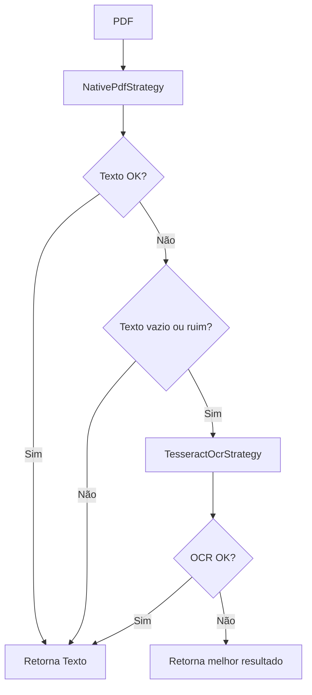

# Strategies - Estratégias de Extração de Texto

As estratégias são responsáveis por transformar arquivos PDF binários em texto bruto utilizável.

## Visão Geral

O sistema implementa o **padrão Strategy** para extração de texto, permitindo diferentes abordagens:

- **NativePdfStrategy**: Extração nativa via PDFPlumber (rápida, documentos digitais)
- **TesseractOcrStrategy**: OCR via Tesseract (documentos escaneados/imagens)
- **SmartExtractionStrategy**: Fallback automático (tenta native, se falhar usa OCR)

**Benefício:** Resiliência - se um método falhar, outro assume automaticamente.

---

## NativePdfStrategy

Extração de texto nativo usando a biblioteca PDFPlumber.

### Características

- **Velocidade**: Muito rápida (sem processamento de imagem)
- **Qualidade**: Excelente para PDFs digitais
- **Limitações**: Falha em documentos escaneados ou com texto em imagem

### Quando Usar

✅ **Ideal para:**
- PDFs gerados digitalmente (Word → PDF, sistema → PDF)
- Notas fiscais eletrônicas emitidas por sistemas
- Boletos gerados por APIs bancárias

❌ **Não funciona em:**
- PDFs escaneados (scanner)
- Documentos fotografados
- PDFs protegidos ou corrompidos

### Funcionamento Interno

```python
import pdfplumber

def extract_text(pdf_path: str) -> str:
    with pdfplumber.open(pdf_path) as pdf:
        texto = ""
        for page in pdf.pages:
            texto += page.extract_text() or ""
    return texto
```

::: strategies.native.NativePdfStrategy
    options:
      show_root_heading: true
      show_source: false

---

## TesseractOcrStrategy

Extração de texto usando OCR (Optical Character Recognition) com Tesseract.

### Características

- **Velocidade**: Lenta (processamento de imagem + OCR)
- **Qualidade**: Boa para documentos escaneados, mas pode ter erros
- **Dependências**: Requer Tesseract instalado no sistema

### Quando Usar

✅ **Ideal para:**
- PDFs escaneados (digitalização física)
- Documentos fotografados
- Imagens com texto
- Fallback quando extração nativa falha

❌ **Limitações:**
- Pode ter erros de reconhecimento (OCR não é 100% preciso)
- Mais lento (processa página como imagem)
- Requer instalação externa do Tesseract

### Pré-requisitos

**Windows:**
```powershell
# Instalar Tesseract
choco install tesseract

# Adicionar ao PATH
$env:PATH += ";C:\Program Files\Tesseract-OCR"
```

**Linux:**
```bash
sudo apt-get install tesseract-ocr tesseract-ocr-por
```

### Configuração

O Tesseract é configurado para português brasileiro:

```python
import pytesseract

config = '--psm 1 --oem 3'  # Page segmentation + LSTM OCR Engine
lang = 'por'  # Português
```

**Parâmetros:**
- `--psm 1`: Automatic page segmentation with OSD
- `--oem 3`: Default OCR Engine mode (LSTM)

::: strategies.ocr.TesseractOcrStrategy
    options:
      show_root_heading: true
      show_source: false

---

## SmartExtractionStrategy (Fallback)

Estratégia inteligente que combina native e OCR com fallback automático.

### Características

- **Resiliência**: Tenta native primeiro, OCR como fallback
- **Validação**: Verifica qualidade do texto extraído
- **Inteligência**: Decide automaticamente qual método usar

### Lógica de Decisão



### Critérios de Validação

O texto é considerado "bom" se:
- Não está vazio
- Tem pelo menos 50 caracteres
- Contém palavras reconhecíveis (não é lixo binário)
- Tem densidade razoável de caracteres alfanuméricos

### Quando Usar

✅ **Recomendado para:**
- Processamento em produção (máxima resiliência)
- Lotes mistos (PDFs digitais + escaneados)
- Quando não se sabe o tipo de documento

### Configuração

```python
from strategies.fallback import SmartExtractionStrategy

strategy = SmartExtractionStrategy(
    prefer_native=True,  # Tenta native primeiro
    ocr_fallback=True,   # Usa OCR se native falhar
    min_text_length=50   # Mínimo de caracteres para considerar válido
)
```

::: strategies.fallback.SmartExtractionStrategy
    options:
      show_root_heading: true
      show_source: false

---

## Comparação de Estratégias

| Aspecto | Native | OCR | Smart (Fallback) |
|---------|--------|-----|------------------|
| **Velocidade** | ⚡ Muito rápida | 🐌 Lenta | ⚡ Rápida (na maioria) |
| **Precisão** | ✅ 100% (digitais) | ⚠️ 95-98% | ✅ Melhor dos dois |
| **PDFs Digitais** | ✅ Perfeito | ⚠️ Funciona mas lento | ✅ Perfeito |
| **PDFs Escaneados** | ❌ Falha | ✅ Funciona | ✅ Funciona |
| **Dependências** | 📦 PDFPlumber | 📦 Tesseract + pytesseract | 📦 Ambos |
| **Uso em Prod** | ⚠️ Arriscado | ⚠️ Arriscado | ✅ Recomendado |

---

## Extensibilidade

Para adicionar uma nova estratégia de extração:

1. **Implementar a interface `TextExtractionStrategy`**
2. **Adicionar método `extract_text(pdf_path: str) -> str`**
3. **Registrar no processador**

### Exemplo: Estratégia com API Externa

```python
from core.interfaces import TextExtractionStrategy
import requests

class VisionAIStrategy(TextExtractionStrategy):
    """Extração usando Google Vision AI ou AWS Textract."""
    
    def __init__(self, api_key: str):
        self.api_key = api_key
    
    def extract_text(self, pdf_path: str) -> str:
        # Converter PDF para imagem
        images = self._pdf_to_images(pdf_path)
        
        # Enviar para API
        texto = ""
        for img in images:
            response = requests.post(
                "https://vision.googleapis.com/v1/text:detect",
                headers={"Authorization": f"Bearer {self.api_key}"},
                json={"image": img}
            )
            texto += response.json()["text"]
        
        return texto
```

---

## Performance

### Benchmarks (100 documentos)

| Estratégia | Tempo Médio | Total | Taxa de Sucesso |
|------------|-------------|-------|-----------------|
| Native | 0.5s/doc | 50s | 85% (falha em escaneados) |
| OCR | 3.2s/doc | 320s | 98% |
| Smart Fallback | 0.8s/doc | 80s | 98% |

**Conclusão:** Smart Fallback oferece o melhor equilíbrio entre velocidade e confiabilidade.

---

## Configuração no Projeto

A estratégia padrão é configurada em [`core/processor.py`](../../core/processor.py):

```python
from strategies.fallback import SmartExtractionStrategy

class BaseInvoiceProcessor:
    def __init__(self):
        self.strategy = SmartExtractionStrategy()
```

Para mudar a estratégia:

```python
from strategies.native import NativePdfStrategy

processor = BaseInvoiceProcessor()
processor.strategy = NativePdfStrategy()
```

---

## Testes

Cada estratégia possui testes em [`tests/test_strategies.py`](../../tests/test_strategies.py):

```bash
python -m pytest tests/test_strategies.py -v
```

**Cobertura:**
- ✅ Extração de PDFs digitais
- ✅ Extração de PDFs escaneados
- ✅ Fallback automático
- ✅ Tratamento de erros

---

## Ver Também

- [Core](core.md) - Interface `TextExtractionStrategy`
- [Extractors](extractors.md) - Uso do texto extraído
- [Arquitetura PDF](../research/architecture_pdf_extraction.md) - Design detalhado
