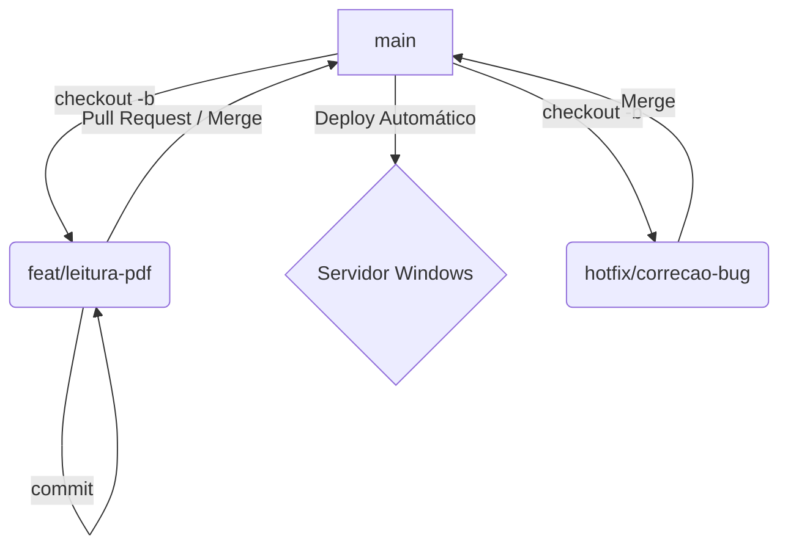

# 🛡️ Git Workflow & Manual de Operações (DevOps)

> **STATUS**: Guia de Referência para Produção (Windows Server + Docker)
> **META**: Manter a sanidade, o histórico limpo e o servidor rodando.

---

## 🏗️ Estrutura de Branches (Mini-Gitflow)

Para a escala atual e o servidor Windows, não precisamos da complexidade de uma branch `develop`. Usaremos o **Feature Branch Workflow**:



* **`main`**: 🛡️ **Sagrada**. Código testado e pronto para produção. Tudo que entra aqui é deployado.
* **`feat/nome-da-feature`**: Onde o trabalho acontece.
* **`hotfix/nome-do-bug`**: Correções urgentes.

---

## 🚨 Protocolo de Emergência (DEU RUIM!)

Se subiu código na `main` e o pessoal do financeiro ligou reclamando: **NÃO tente consertar correndo.**

### 1. Estancar o Sangramento (Rollback)

O objetivo é voltar o sistema pro ar imediatamente.

```bash
# 1. Identifique o hash do commit ruim (ex: abc1234)
git log --oneline

# 2. Crie o "Contra-Commit" (Desfaz a mudança sem apagar histórico)
git revert abc1234

# 3. Mande pra produção (O hook do servidor vai reiniciar o Docker com a versão antiga)
git push origin main
git push servidor main

```

### 2. Diagnóstico

Com a produção salva, respire e veja os logs para entender o erro.

```bash
# No servidor (via SSH)
docker logs --tail 100 -f scrapper_nfe_app_1

# Ou baixe o arquivo de log persistente
scp usuario@ip-servidor:C:/Servidor/apps/scrapper_nfe/data/app.log ./debug/

```

### 3. A Correção (Hotfix)

Agora sim, corrija o bug com calma.

```bash
git checkout main
git pull
git checkout -b hotfix/corrige-ocr-timeout

# ... trabalha, testa, commita ...

git commit -m "fix(ocr): aumenta timeout para 60s"
git checkout main
git merge hotfix/corrige-ocr-timeout
git tag -a v1.0.2 -m "Fix: OCR Timeout"
git push origin main --tags
git push servidor main

```

---

## 📝 Convenção de Commits (Conventional Commits)

Padronização é vida. O prefixo ajuda a gerar changelogs automáticos.

| Tipo | Quando usar | Exemplo |
| --- | --- | --- |
| **feat** | Nova funcionalidade | `feat(email): adiciona filtro por assunto` |
| **fix** | Correção de bug | `fix(regex): ajusta captura de data` |
| **docs** | Documentação | `docs: atualiza README` |
| **refactor** | Melhoria de código (sem mudar função) | `refactor: move classes para core/` |
| **chore** | Configuração/Build | `chore(docker): atualiza versão do python` |
| **test** | Testes | `test: adiciona teste de boleto nubank` |

**Dica:** O escopo entre parênteses `(escopo)` ajuda muito a saber onde foi a mudança.

---

## 🚀 Workflow de Desenvolvimento (Dia a Dia)

### 1. Começando uma Feature

```bash
git checkout main
git pull origin main
git checkout -b feat/nova-extracao

```

### 2. Durante o Trabalho

```bash
git add .
git commit -m "feat(pdf): implementa leitura de tabelas"
# Se precisar salvar work-in-progress:
git commit -m "wip: salvando progresso na tabela"

```

### 3. Finalizando e Deployando

```bash
# 1. Garanta que está atualizado com a main
git checkout main
git pull origin main

# 2. Mergeie sua feature
git merge feat/nova-extracao --no-ff

# 3. Suba para o GitHub (Backup)
git push origin main

# 4. Suba para o Servidor da Firma (Deploy)
git push servidor main

```

> *Nota: O comando `--no-ff` (no fast-forward) cria um "nó" no histórico, facilitando ver onde a feature começou e terminou.*

---

## 📦 Versionamento (Semântico)

Use Tags para marcar entregas importantes. O Docker não liga para tags, mas humanos sim.

* **Major (v2.0.0)**: Quebrou compatibilidade (mudou banco, mudou regras críticas).
* **Minor (v1.2.0)**: Nova funcionalidade (funciona com o anterior).
* **Patch (v1.2.1)**: Bugfix simples.

```bash
git tag -a v1.0.0 -m "Versão Inicial Estável - Leitura NFSe"
git push origin --tags

```

---

## 🔮 Futuro: CI/CD (GitHub Actions)

Quando tiver testes automatizados rodando confiáveis:

```yaml
# .github/workflows/ci.yml
name: CI/CD Pipeline
on: [push]

jobs:
  test:
    runs-on: ubuntu-latest
    steps:
      - uses: actions/checkout@v3
      - name: Rodar Testes
        run: |
          pip install -r requirements.txt
          pytest

  deploy:
    needs: test
    if: github.ref == 'refs/heads/main'
    runs-on: ubuntu-latest
    steps:
      - name: Deploy via SSH
        uses: appleboy/ssh-action@master
        with:
          host: ${{ secrets.SERVER_HOST }}
          username: ${{ secrets.SERVER_USER }}
          key: ${{ secrets.SSH_PRIVATE_KEY }}
          script: |
            cd C:/Servidor/git/scrapper.git
            # O hook post-receive fará o resto

```

---

**Última atualização:** 2025-12-19
**Responsável:** Rafael Ferreira