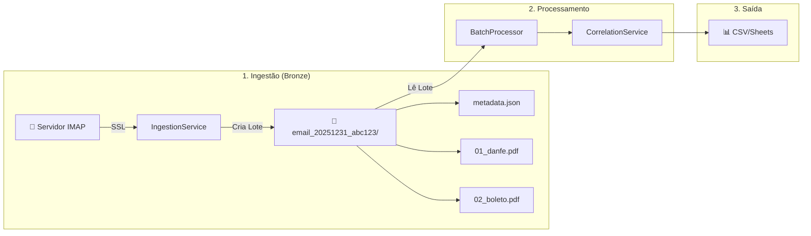

# Guia de Ingestão de E-mails

Este guia descreve como configurar e executar o pipeline de ingestão automática de documentos fiscais via e-mail.

## Visão Geral

O módulo de ingestão conecta-se a uma conta de e-mail via protocolo IMAP, busca por mensagens contendo documentos fiscais (filtrando por assunto), organiza os anexos em **lotes por e-mail** e os encaminha para o processador de extração com correlação automática.

!!! info "Novidade v0.2.x"
A partir da versão 0.2.x, cada e-mail gera uma **pasta de lote** contendo todos os anexos + um arquivo `metadata.json` com o contexto do e-mail (assunto, remetente, corpo). Isso permite correlacionar DANFE com Boleto automaticamente.

## Arquitetura de Ingestão



## Configuração de Segurança (.env)

Por razões de segurança, as credenciais de e-mail **nunca** devem ser colocadas diretamente no código. Utilizamos um arquivo `.env` para gerenciar essas variáveis.

1. Crie um arquivo chamado `.env` na raiz do projeto (você pode copiar o modelo `.env.example`).
2. Preencha as seguintes variáveis:

```ini
# Configurações do Servidor IMAP
EMAIL_HOST=imap.gmail.com          # Ex: imap.gmail.com, outlook.office365.com
EMAIL_USER=seu.email@exemplo.com
EMAIL_PASS=sua_senha_de_app        # Use Senha de Aplicativo (App Password) se tiver 2FA ativado
EMAIL_FOLDER=INBOX                 # Pasta a ser monitorada
```

!!! warning "Atenção"
Se você utiliza Gmail ou Outlook com autenticação de dois fatores (2FA), a sua senha de login normal **não funcionará**. Você deve gerar uma "Senha de Aplicativo" nas configurações de segurança da sua conta.

## Executando a Ingestão

### Modo Padrão (v0.2.x - Batch Processing)

```bash
python run_ingestion.py
```

Este comando:

1. **Conecta** ao servidor de e-mail usando SSL
2. **Busca** e-mails com o assunto configurado (default: "Nota Fiscal")
3. **Cria lotes** para cada e-mail em `temp_email/email_<timestamp>_<id>/`
4. **Salva metadata** com contexto do e-mail (`metadata.json`)
5. **Processa** cada lote usando o `BatchProcessor`
6. **Correlaciona** documentos (DANFE + Boleto) usando `CorrelationService`
7. **Gera** relatórios em `data/output/relatorio_ingestao.csv`

### Flags Disponíveis (CLI)

| Flag               | Descrição                                            | Exemplo                                                       |
| :----------------- | :--------------------------------------------------- | :------------------------------------------------------------ |
| `--reprocess`      | Reprocessa lotes existentes sem baixar novos e-mails | `python run_ingestion.py --reprocess`                         |
| `--batch-folder`   | Processa uma pasta de lote específica                | `python run_ingestion.py --batch-folder temp_email/email_123` |
| `--subject`        | Filtro de assunto customizado                        | `python run_ingestion.py --subject "NF-e"`                    |
| `--no-correlation` | Desabilita correlação entre documentos               | `python run_ingestion.py --no-correlation`                    |
| `--cleanup`        | Remove lotes antigos após processamento              | `python run_ingestion.py --cleanup`                           |

### Exemplos de Uso

```bash
# Ingestão padrão com correlação
python run_ingestion.py

# Reprocessar lotes existentes (útil após atualizar regras)
python run_ingestion.py --reprocess

# Processar uma pasta específica
python run_ingestion.py --batch-folder temp_email/email_20251215_abc123

# Filtrar por assunto customizado
python run_ingestion.py --subject "Fatura de Energia"

# Ingestão sem correlação (modo legado)
python run_ingestion.py --no-correlation

# Ingestão com limpeza automática de lotes antigos
python run_ingestion.py --cleanup
```

## Estrutura de um Lote

Cada e-mail processado gera uma pasta com a seguinte estrutura:

```
temp_email/
└── email_20251231_abc123/          # ID único por e-mail
    ├── metadata.json               # Contexto do e-mail
    ├── 01_danfe.pdf                # Anexos numerados para ordenação
    ├── 02_boleto.pdf
    └── ignored/                    # (Opcional) Arquivos ignorados
        └── image001.png            # Assinaturas de e-mail, etc.
```

### Arquivo metadata.json

O arquivo `metadata.json` contém o contexto do e-mail original:

```json
{
    "batch_id": "email_20251231_abc123",
    "email_subject": "[NF] Nota Fiscal #12345 - Fornecedor LTDA",
    "email_sender_name": "Fornecedor LTDA",
    "email_sender_address": "nf@fornecedor.com.br",
    "email_body_text": "Segue em anexo a NF 12345. CNPJ: 12.345.678/0001-90",
    "received_date": "2025-01-15T10:30:00",
    "attachments": ["01_danfe.pdf", "02_boleto.pdf"],
    "created_at": "2025-01-15T10:35:22"
}
```

Esses metadados são usados pelo `CorrelationService` para:

- Extrair CNPJ do corpo do e-mail (fallback)
- Usar nome do remetente como `fornecedor_nome` (fallback)
- Extrair número de pedido do assunto

## Correlação Automática

Quando um lote contém múltiplos documentos (ex: DANFE + Boleto), o sistema correlaciona automaticamente:

### Regras de Herança

| Se o lote tem  | Campo faltando           | Herda de |
| :------------- | :----------------------- | :------- |
| DANFE + Boleto | Boleto sem `numero_nota` | DANFE    |
| DANFE + Boleto | DANFE sem `vencimento`   | Boleto   |
| NFSe + Boleto  | Boleto sem `numero_nota` | NFSe     |

### Regras de Fallback

| Campo faltando    | Fallback                           |
| :---------------- | :--------------------------------- |
| `fornecedor_nome` | `email_sender_name` do metadata    |
| `cnpj`            | CNPJ extraído do `email_body_text` |
| `numero_pedido`   | Extraído do assunto/corpo          |

### Status de Conciliação

| Situação                    | Status       |
| :-------------------------- | :----------- |
| Valor DANFE = Valor Boletos | `OK`         |
| Valor DANFE ≠ Valor Boletos | `DIVERGENTE` |
| Só Boleto (sem nota)        | `ORFAO`      |

## Limpeza Automática (Docker)

Se você usa Docker, um serviço sidecar remove automaticamente lotes com mais de 48 horas:

```yaml
# docker-compose.yml
cleaner:
    image: alpine:latest
    container_name: scrapper_nfe_cleaner
    volumes:
        - temp_email:/app/temp_email
    command: >
        sh -c "while true; do
          find /app/temp_email -type f -mtime +2 -delete &&
          find /app/temp_email -type d -empty -delete &&
          sleep 86400;
        done"
```

Para limpeza manual:

```bash
python run_ingestion.py --cleanup
```

## Personalização

### Filtro de Busca

Você pode ajustar o filtro de busca editando o arquivo `run_ingestion.py` ou usando a flag `--subject`:

```python
# run_ingestion.py
assunto_teste = "Nota Fiscal"  # Altere para o assunto que seus fornecedores usam
```

### Usando o IngestionService Programaticamente

```python
from services.ingestion_service import IngestionService
from ingestors.imap import ImapIngestor
from pathlib import Path

# Configurar ingestor
ingestor = ImapIngestor()

# Criar serviço de ingestão
service = IngestionService(ingestor, temp_dir=Path("temp_email"))

# Ingerir e-mails e criar lotes
batch_folders = service.ingest_emails(subject_filter="Nota Fiscal")

# Processar cada lote
for folder in batch_folders:
    result = service.process_batch(folder, apply_correlation=True)
    print(f"Lote {folder.name}: {len(result.all_documents)} documentos")

# Limpar lotes antigos
removed = service.cleanup_old_batches(max_age_hours=48)
print(f"Removidos {removed} lotes antigos")
```

## Validação de Regras

Para testar as regras de extração em lotes existentes:

```bash
# Modo legado (PDFs soltos em failed_cases_pdf/)
python scripts/validate_extraction_rules.py

# Modo batch (lotes com metadata.json)
python scripts/validate_extraction_rules.py --batch-mode

# Com correlação
python scripts/validate_extraction_rules.py --batch-mode --apply-correlation
```

## Solução de Problemas Comuns

### Erro de Conexão IMAP

```
imaplib.error: LOGIN failed
```

**Solução:** Verifique se você está usando uma Senha de Aplicativo (App Password) se tiver 2FA ativado.

### Lotes Não Correlacionados

Se boletos não estão sendo vinculados às notas:

1. Verifique se estão no mesmo lote (mesma pasta)
2. Confira se o `metadata.json` existe
3. Rode com debug: `python run_ingestion.py --batch-folder <pasta> 2>&1 | tee debug.log`

### Limpeza Manual de Lotes

```bash
# Remover lotes com mais de 7 dias
find temp_email -type d -mtime +7 -exec rm -rf {} +
```

## Próximos Passos

- [Guia de Uso](usage.md) - Processar PDFs locais
- [Quick Start Boletos](quickstart_boletos.md) - Extrair boletos rapidamente
- [Migração Batch](../MIGRATION_BATCH_PROCESSING.md) - Migrar do v0.1.x para v0.2.x
- [API Reference](../api/overview.md) - Documentação técnica
