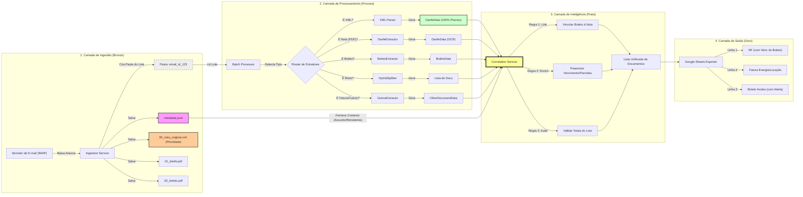

# Pipeline de Automação de Entradas Fiscais


Bem-vindo à documentação oficial do projeto de automação fiscal. Este sistema foi projetado para eliminar o gargalo manual no recebimento e lançamento de Notas Fiscais, DANFEs e Boletos, garantindo integridade de dados e integração direta com o ERP.

O projeto opera sobre **quatro camadas fundamentais**: **Ingestão (Bronze)**, **Processamento**, **Correlação (Prata)** e **Saída (Ouro)**.

---

## 🚀 Quick Start

Comece a processar documentos em menos de 5 minutos.

<div class="grid cards" markdown>

- :material-email-fast: **Ingestão Automática (Lotes)**

    Configure o `.env` e baixe notas direto do Gmail/Outlook em lotes organizados.
    [Guia de Ingestão](guide/ingestion.md)

- :material-file-document-outline: **Processamento Local**

    Tem uma pasta cheia de PDFs? Processe tudo de uma vez com correlação automática.
    [Guia de Uso](guide/usage.md)

- :material-link-variant: **Correlação DANFE + Boleto**

    Vincule automaticamente boletos às suas notas fiscais correspondentes.
    [Migração Batch](development/MIGRATION_BATCH_PROCESSING.md)

- :material-api: **Referência da API**

    Detalhes técnicos das classes e métodos internos.
    [API Reference](api/overview.md)

- :material-google-spreadsheet: **Exportação Google Sheets** 🆕

    Exporte documentos processados para planilhas com separação automática.
    [Guia de Exportação](guide/google_sheets_export.md)

</div>

---

## 🏗️ Arquitetura do Processo (v0.2.x - Batch Processing)

O fluxo de dados foi redesenhado para processar **lotes de documentos por e-mail**, permitindo correlação entre DANFE e Boleto:



---

## 🔄 1. Ingestão em Lotes (Bronze)

Responsável pela **monitoria, captura e organização** dos documentos fiscais.

- **Protocolo IMAP:** Conexão persistente e segura (SSL) com provedores modernos (Gmail, Office 365).
- **Organização por Lote:** Cada e-mail gera uma pasta única com `metadata.json` contendo contexto (assunto, remetente, corpo).
- **Segurança:** Credenciais gerenciadas via variáveis de ambiente (`.env`), suportando _App Passwords_ para contornar 2FA.
- **Limpeza Automática:** Sidecar Docker remove lotes processados após 48 horas.

---

## ⛏️ 2. Extração Inteligente (Processamento)

O núcleo do projeto transforma documentos desestruturados em dados estruturados.

### Funcionalidades Chave

1. **Estratégia Híbrida (Fallback):**
    - Tenta leitura nativa (`pdfplumber`) primeiro: **~0.1s/arquivo**.
    - Falha graciosamente para OCR (`Tesseract`) se necessário: **~3.0s/arquivo**.
2. **Detecção de Tipo:** Router automático identifica DANFE, Boleto, NFSe, Fatura ou documento misto.
3. **Prioridade XML:** Se houver XML da NF-e no lote, dados são extraídos com 100% de precisão.

---

## 🔗 3. Correlação (Prata)

O `CorrelationService` é o diferencial da v0.2.x:

| Regra         | Descrição                                                                         |
| :------------ | :-------------------------------------------------------------------------------- |
| **Herança**   | Boleto herda `numero_nota` da DANFE; DANFE herda `vencimento` do Boleto           |
| **Fallback**  | Se `fornecedor_nome` está vazio, usa `email_sender_name` do metadata              |
| **Validação** | Compara soma dos boletos vs valor da DANFE → Status `OK`, `DIVERGENTE` ou `ORFAO` |

---

## 📤 4. Saída (Ouro)

Dados enriquecidos e validados prontos para integração:

- **CSV Consolidado** em `data/output/`
- **Debug CSVs** em `data/debug_output/` (separados por tipo: danfe, boleto, nfse, outros)
- **Google Sheets** 🆕 com exportação para duas abas:
    - `anexos`: Documentos com anexo (NFs, Boletos, DANFEs)
    - `sem_anexos`: E-mails com links (sem PDF anexado)

---

## 🔧 Debugging e Diagnóstico

O sistema inclui uma suite completa de scripts para debugging e diagnóstico de problemas de extração:

| Problema                    | Scripts Recomendados                                     | Descrição                                           |
| --------------------------- | -------------------------------------------------------- | --------------------------------------------------- |
| **Debug de PDF individual** | `inspect_pdf.py`, `test_extractor_routing.py`            | Inspeção rápida de campos extraídos e texto bruto   |
| **Lotes problemáticos**     | `simple_list.py`, `list_problematic.py`                  | Identificação de lotes com "outros > 0 e valor = 0" |
| **Problemas OCR**           | `inspect_pdf.py --raw`, `validate_extraction_rules.py`   | Análise de texto e validação após correções         |
| **Validação de extratores** | `validate_extraction_rules.py --batch-mode --temp-email` | Teste após modificar extratores                     |
| **Análise de logs**         | `analyze_logs.py`, `analyze_batch_health.py`             | Análise de logs e saúde dos batches                 |
| **Análise de e-mails**      | `diagnose_inbox_patterns.py`                             | Identificação de padrões úteis                      |

**Documentação completa**: Consulte o [Guia de Debug](development/debugging_guide.md) para workflows detalhados e a [Referência Rápida](debug/scripts_quick_reference.md) para comandos essenciais.

---

## 📂 Estrutura do Projeto

Organização seguindo princípios de _Clean Architecture_ e SOLID:

```bash
scrapper/
│
├── config/                     # Settings e carregamento de .env
│   ├── __init__.py
│   ├── bancos.py
│   ├── empresas.py
│   ├── feriados_sp.py
│   └── settings.py
│
├── core/                       # Lógica central do negócio
│   ├── __init__.py
│   ├── batch_processor.py      # 🆕 BatchProcessor (processa lotes)
│   ├── batch_result.py         # 🆕 BatchResult (resultado de lote)
│   ├── correlation_service.py  # 🆕 CorrelationService (vinculação)
│   ├── diagnostics.py          # Sistema de análise de qualidade
│   ├── document_pairing.py     # 🆕 Pareamento de documentos (NF vs Boleto)
│   ├── empresa_matcher.py      # 🆕 Lógica para identificar empresa
│   ├── exceptions.py           # Exceções customizadas
│   ├── exporters.py            # 🆕 Exportadores de dados (CSV, Sheets)
│   ├── extractors.py           # Classe base e registry de extratores
│   ├── interfaces.py           # Interfaces e contratos
│   ├── metadata.py             # 🆕 EmailMetadata (contexto do e-mail)
│   ├── models.py               # Modelos de dados (InvoiceData, BoletoData, DanfeData)
│   └── processor.py            # Orquestrador principal
│
├── services/                   # 🆕 Serviços de alto nível
│   ├── __init__.py
│   └── ingestion_service.py    # Serviço de ingestão com lotes
│
├── extractors/                 # Extratores especializados (24+ extratores)
│   ├── __init__.py             # Registry com ordem de prioridade
│   ├── acimoc_extractor.py     # Boletos ACIMOC
│   ├── aditivo_contrato.py     # Aditivos de contrato
│   ├── admin_document.py       # Documentos administrativos
│   ├── boleto.py               # Boletos genéricos
│   ├── boleto_gox.py           # Boletos GOX S.A.
│   ├── boleto_repromaq.py      # Boletos REPROMAQ
│   ├── comprovante_bancario.py # Comprovantes TED/PIX/DOC
│   ├── csc_nota_debito.py      # Nota Débito CSC GESTÃO
│   ├── danfe.py                # DANFE genérico
│   ├── email_body_extractor.py # Extração de corpo de e-mail
│   ├── emc_fatura.py           # Faturas EMC Tecnologia
│   ├── mugo_extractor.py       # Faturas MUGO Telecom
│   ├── net_center.py           # NFSe Net Center
│   ├── nfcom_telcables_extractor.py # NFCom Telcables
│   ├── nfse_custom_montes_claros.py
│   ├── nfse_custom_vila_velha.py
│   ├── nfse_generic.py         # NFSe genérico (fallback)
│   ├── ocr_danfe.py            # DANFE com OCR corrompido
│   ├── outros.py               # Documentos diversos
│   ├── pro_painel_extractor.py # Faturas PRÓ-PAINEL
│   ├── sabesp.py               # Faturas Sabesp (email body)
│   ├── sicoob.py               # Boletos Sicoob
│   ├── tunna_fatura.py         # Faturas Tunna/FishTV
│   ├── ufinet.py               # Faturas Ufinet
│   ├── utility_bill.py         # Contas de utilidade
│   ├── utils.py                # Funções utilitárias
│   └── xml_extractor.py        # Extração de XMLs fiscais
│
├── strategies/                 # Estratégias de extração de texto
│   ├── __init__.py
│   ├── fallback.py
│   ├── native.py
│   ├── ocr.py
│   └── table.py
│
├── ingestors/                  # Conectores de entrada
│   ├── __init__.py
│   ├── imap.py
│   └── utils.py
│
├── data/                       # Dados (Entrada/Saída)
│   ├── debug_output/           # Saída dos testes de regras (CSV de debug)
│   └── output/                 # Relatórios finais de ingestão
│
├── temp_email/                 # 🆕 Pastas de lotes (batch folders)
│   └── email_20251231_abc123/  # Exemplo de lote
│       ├── metadata.json
│       ├── 01_danfe.pdf
│       └── 02_boleto.pdf
│
├── docs/                       # Documentação MkDocs
│   ├── api/
│   ├── analysis/
│   ├── debug/
│   ├── development/
│   ├── docker/
│   ├── guide/
│   └── research/
│
├── scripts/                    # Scripts utilitários e de diagnóstico (debug, análise, validação)
│   ├── _init_env.py
│   ├── analyze_batch_health.py        # Análise de saúde dos batches
│   ├── analyze_logs.py                # Análise de logs do sistema
│   ├── analyze_report.py              # Análise de relatórios gerados
│   ├── check_problematic_pdfs.py      # Análise de PDFs problemáticos
│   ├── clean_dev.py                   # Limpeza de arquivos temporários
│   ├── consolidate_batches.py         # Consolidação de resultados
│   ├── diagnose_inbox_patterns.py     # Análise de padrões de inbox
│   ├── example_batch_processing.py    # Exemplo de processamento
│   ├── export_to_sheets.py            # Exportação Google Sheets (v0.3.x)
│   ├── extract_case_simple.py         # Extração simples de casos
│   ├── extract_cases.py               # Extração de casos para análise
│   ├── generate_report.py             # Relatório pyright JSON→Markdown
│   ├── ingest_emails_no_attachment.py # Ingestão de e-mails sem anexo
│   ├── inspect_pdf.py                 # Inspeção rápida de PDFs
│   ├── list_problematic.py            # Lista detalhada de lotes problemáticos
│   ├── repro_extraction_failure.py    # Reprodução de falhas de extração
│   ├── simple_list.py                 # Lista simples de lotes problemáticos
│   ├── test_admin_detection.py        # Teste de detecção administrativa
│   ├── test_docker_setup.py           # Teste de configuração Docker
│   ├── test_extractor_routing.py      # Teste de roteamento de extratores
│   └── validate_extraction_rules.py   # Validação de regras (--temp-email, --batches)
│
├── tests/                      # Testes Unitários e de Integração
├── run_ingestion.py            # CLI para ingestão de e-mail (atualizado v0.2.x)
└── docker-compose.yml          # Inclui sidecar de limpeza
```

---

## 🆕 Novidades da v0.3.x (Google Sheets Export)

| Feature                                | v0.1.x | v0.2.x     | v0.3.x     |
| -------------------------------------- | ------ | ---------- | ---------- |
| Processar arquivo individual           | ✅     | ✅         | ✅         |
| Processar pasta de arquivos            | ✅     | ✅         | ✅         |
| Processar lote com metadata            | ❌     | ✅         | ✅         |
| Correlação DANFE/Boleto                | ❌     | ✅         | ✅         |
| Contexto do e-mail                     | ❌     | ✅         | ✅         |
| Limpeza automática                     | Manual | Automática | Automática |
| Status de conciliação                  | ❌     | ✅         | ✅         |
| **Exportação Google Sheets (2 abas)**  | ❌     | ❌         | ✅         |
| **Cálculo automático de situação**     | ❌     | ❌         | ✅         |
| **Alertas de vencimento (dias úteis)** | ❌     | ❌         | ✅         |

Para migrar do v0.1.x para v0.2.x, consulte o [Guia de Migração](development/MIGRATION_BATCH_PROCESSING.md).

Para configurar a exportação para Google Sheets, consulte o [Guia de Exportação](guide/google_sheets_export.md).

---

## 🎯 Modelo de Dados

### Campos Base (todos os documentos)

| Campo                  | Descrição                  | Tipo     |
| :--------------------- | :------------------------- | :------- |
| `arquivo_origem`       | Nome do arquivo processado | `string` |
| `batch_id`             | 🆕 ID do lote de origem    | `string` |
| `source_email_subject` | 🆕 Assunto do e-mail       | `string` |
| `source_email_sender`  | 🆕 Remetente do e-mail     | `string` |
| `status_conciliacao`   | 🆕 OK, DIVERGENTE ou ORFAO | `string` |

### Campos de Nota Fiscal

| Campo            | Descrição                             | Tipo     |
| :--------------- | :------------------------------------ | :------- |
| `cnpj_prestador` | Identificação fiscal do fornecedor    | `string` |
| `numero_nota`    | Número da NFS-e/DANFE                 | `string` |
| `data_emissao`   | Data de competência (ISO 8601)        | `date`   |
| `valor_total`    | Valor líquido da nota                 | `float`  |
| `vencimento`     | Herdado do boleto (se correlacionado) | `date`   |

### Campos de Boleto

| Campo               | Descrição               | Tipo     |
| :------------------ | :---------------------- | :------- |
| `cnpj_beneficiario` | CNPJ do beneficiário    | `string` |
| `valor_documento`   | Valor nominal do boleto | `float`  |
| `vencimento`        | Data de vencimento      | `date`   |
| `linha_digitavel`   | Código de barras        | `string` |
| `referencia_nfse`   | Número da NF vinculada  | `string` |

---

## 🔗 Links Rápidos

- [📧 Guia de Ingestão](guide/ingestion.md) - Configurar e-mail e processar lotes
- [📤 Exportação Google Sheets](guide/google_sheets_export.md) - 🆕 Exportar para planilhas
- [🔄 Migração Batch](development/MIGRATION_BATCH_PROCESSING.md) - Migrar do v0.1.x para v0.2.x
- [🧪 Guia de Testes](guide/testing.md) - Validar regras de extração
- [📊 API Reference](api/overview.md) - Documentação técnica completa
- [🏗️ Arquitetura PDF](research/architecture_pdf_extraction.md) - Detalhes de extração
- [📈 Histórico de Refatorações](development/refactoring_history.md) - Changelog técnico
