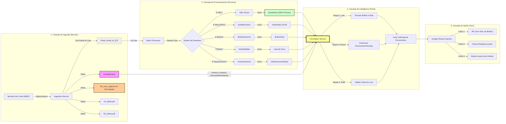

# Pipeline de Automação de Entradas Fiscais


Bem-vindo à documentação oficial do projeto de automação fiscal. Este sistema foi projetado para eliminar o gargalo manual no recebimento e lançamento de Notas Fiscais, DANFEs e Boletos, garantindo integridade de dados e integração direta com o ERP.

O projeto opera sobre **quatro camadas fundamentais**: **Ingestão (Bronze)**, **Processamento**, **Correlação (Prata)** e **Saída (Ouro)**.

---

## 🚀 Quick Start

Comece a processar documentos em menos de 5 minutos.

<div class="grid cards" markdown>

- :material-email-fast: **Ingestão Automática (Lotes)**

    Configure o `.env` e baixe notas direto do Gmail/Outlook em lotes organizados.
    [Guia de Ingestão](guide/ingestion.md)

- :material-file-document-outline: **Processamento Local**

    Tem uma pasta cheia de PDFs? Processe tudo de uma vez com correlação automática.
    [Guia de Uso](guide/usage.md)

- :material-link-variant: **Correlação DANFE + Boleto**

    Vincule automaticamente boletos às suas notas fiscais correspondentes.
    [Migração Batch](MIGRATION_BATCH_PROCESSING.md)

- :material-api: **Referência da API**

    Detalhes técnicos das classes e métodos internos.
    [API Reference](api/overview.md)

</div>

---

## 🏗️ Arquitetura do Processo (v0.2.x - Batch Processing)

O fluxo de dados foi redesenhado para processar **lotes de documentos por e-mail**, permitindo correlação entre DANFE e Boleto:



---

## 🔄 1. Ingestão em Lotes (Bronze)

Responsável pela **monitoria, captura e organização** dos documentos fiscais.

- **Protocolo IMAP:** Conexão persistente e segura (SSL) com provedores modernos (Gmail, Office 365).
- **Organização por Lote:** Cada e-mail gera uma pasta única com `metadata.json` contendo contexto (assunto, remetente, corpo).
- **Segurança:** Credenciais gerenciadas via variáveis de ambiente (`.env`), suportando _App Passwords_ para contornar 2FA.
- **Limpeza Automática:** Sidecar Docker remove lotes processados após 48 horas.

---

## ⛏️ 2. Extração Inteligente (Processamento)

O núcleo do projeto transforma documentos desestruturados em dados estruturados.

### Funcionalidades Chave

1. **Estratégia Híbrida (Fallback):**
    - Tenta leitura nativa (`pdfplumber`) primeiro: **~0.1s/arquivo**.
    - Falha graciosamente para OCR (`Tesseract`) se necessário: **~3.0s/arquivo**.
2. **Detecção de Tipo:** Router automático identifica DANFE, Boleto, NFSe, Fatura ou documento misto.
3. **Prioridade XML:** Se houver XML da NF-e no lote, dados são extraídos com 100% de precisão.

---

## 🔗 3. Correlação (Prata)

O `CorrelationService` é o diferencial da v0.2.x:

| Regra         | Descrição                                                                         |
| :------------ | :-------------------------------------------------------------------------------- |
| **Herança**   | Boleto herda `numero_nota` da DANFE; DANFE herda `vencimento` do Boleto           |
| **Fallback**  | Se `fornecedor_nome` está vazio, usa `email_sender_name` do metadata              |
| **Validação** | Compara soma dos boletos vs valor da DANFE → Status `OK`, `DIVERGENTE` ou `ORFAO` |

---

## 📤 4. Saída (Ouro)

Dados enriquecidos e validados prontos para integração:

- **CSV Consolidado** em `data/output/`
- **Debug CSVs** em `data/debug_output/` (separados por tipo: danfe, boleto, nfse, outros)
- **Google Sheets** (futuro) com atualização em tempo real

---

## 📂 Estrutura do Projeto

Organização seguindo princípios de _Clean Architecture_ e SOLID:

```bash
scrapper/
│
├── config/                     # Settings e carregamento de .env
├── core/                       # Lógica central do negócio
│   ├── processor.py            # Orquestrador principal
│   ├── models.py               # Modelos de dados (InvoiceData, BoletoData, DanfeData)
│   ├── extractors.py           # Classe base e registry de extratores
│   ├── metadata.py             # 🆕 EmailMetadata (contexto do e-mail)
│   ├── batch_processor.py      # 🆕 BatchProcessor (processa lotes)
│   ├── batch_result.py         # 🆕 BatchResult (resultado de lote)
│   ├── correlation_service.py  # 🆕 CorrelationService (vinculação)
│   ├── diagnostics.py          # Sistema de análise de qualidade
│   ├── interfaces.py           # Interfaces e contratos
│   └── exceptions.py           # Exceções customizadas
│
├── services/                   # 🆕 Serviços de alto nível
│   └── ingestion_service.py    # Serviço de ingestão com lotes
│
├── extractors/                 # Extratores especializados
│   ├── generic.py              # Extração de NFSe genéricas
│   ├── boleto.py               # Extração de boletos bancários
│   └── danfe.py                # Extração de DANFE
│
├── strategies/                 # Estratégias de extração de texto
│   ├── native.py               # PDFPlumber (rápido, nativo)
│   ├── ocr.py                  # Tesseract OCR (documentos escaneados)
│   └── fallback.py             # Combinação automática (fallback chain)
│
├── ingestors/                  # Conectores de entrada
│   └── imap.py                 # Ingestão via e-mail IMAP
│
├── data/                       # Dados (Entrada/Saída)
│   ├── debug_output/           # Saída dos testes de regras (CSV de debug)
│   └── output/                 # Relatórios finais de ingestão
│
├── temp_email/                 # 🆕 Pastas de lotes (batch folders)
│   └── email_20251231_abc123/  # Exemplo de lote
│       ├── metadata.json       # Contexto do e-mail
│       ├── 01_danfe.pdf        # Anexos numerados
│       └── 02_boleto.pdf
│
├── docs/                       # Documentação MkDocs
├── scripts/                    # Scripts utilitários e de diagnóstico
│   ├── validate_extraction_rules.py  # Valida regras (legacy + batch mode)
│   ├── example_batch_processing.py   # 🆕 Exemplos de batch processing
│   ├── inspect_pdf.py                # 🆕 Inspeção rápida de PDFs (busca automática)
│   └── test_docker_setup.py          # Testa setup Docker/Tesseract
│
├── tests/                      # Testes Unitários e de Integração
├── run_ingestion.py            # CLI para ingestão de e-mail (atualizado v0.2.x)
└── docker-compose.yml          # Inclui sidecar de limpeza
```

---

## 🆕 Novidades da v0.2.x (Batch Processing)

| Feature                         | v0.1.x | v0.2.x     |
| ------------------------------- | ------ | ---------- |
| Processar arquivo individual    | ✅     | ✅         |
| Processar pasta de arquivos     | ✅     | ✅         |
| **Processar lote com metadata** | ❌     | ✅         |
| **Correlação DANFE/Boleto**     | ❌     | ✅         |
| **Contexto do e-mail**          | ❌     | ✅         |
| **Limpeza automática**          | Manual | Automática |
| **Status de conciliação**       | ❌     | ✅         |

Para migrar do v0.1.x para v0.2.x, consulte o [Guia de Migração](MIGRATION_BATCH_PROCESSING.md).

---

## 🎯 Modelo de Dados

### Campos Base (todos os documentos)

| Campo                  | Descrição                  | Tipo     |
| :--------------------- | :------------------------- | :------- |
| `arquivo_origem`       | Nome do arquivo processado | `string` |
| `batch_id`             | 🆕 ID do lote de origem    | `string` |
| `source_email_subject` | 🆕 Assunto do e-mail       | `string` |
| `source_email_sender`  | 🆕 Remetente do e-mail     | `string` |
| `status_conciliacao`   | 🆕 OK, DIVERGENTE ou ORFAO | `string` |

### Campos de Nota Fiscal

| Campo            | Descrição                                | Tipo     |
| :--------------- | :--------------------------------------- | :------- |
| `cnpj_prestador` | Identificação fiscal do fornecedor       | `string` |
| `numero_nota`    | Número da NFS-e/DANFE                    | `string` |
| `data_emissao`   | Data de competência (ISO 8601)           | `date`   |
| `valor_total`    | Valor líquido da nota                    | `float`  |
| `vencimento`     | 🆕 Herdado do boleto (se correlacionado) | `date`   |

### Campos de Boleto

| Campo               | Descrição                 | Tipo     |
| :------------------ | :------------------------ | :------- |
| `cnpj_beneficiario` | CNPJ do beneficiário      | `string` |
| `valor_documento`   | Valor nominal do boleto   | `float`  |
| `vencimento`        | Data de vencimento        | `date`   |
| `linha_digitavel`   | Código de barras          | `string` |
| `referencia_nfse`   | 🆕 Número da NF vinculada | `string` |

---

## 🔗 Links Rápidos

- [📧 Guia de Ingestão](guide/ingestion.md) - Configurar e-mail e processar lotes
- [🔄 Migração Batch](MIGRATION_BATCH_PROCESSING.md) - Migrar do v0.1.x para v0.2.x
- [🧪 Guia de Testes](guide/testing.md) - Validar regras de extração
- [📊 API Reference](api/overview.md) - Documentação técnica completa
- [🏗️ Arquitetura PDF](research/architecture_pdf_extraction.md) - Detalhes de extração
- [📈 Histórico de Refatorações](development/refactoring_history.md) - Changelog técnico
