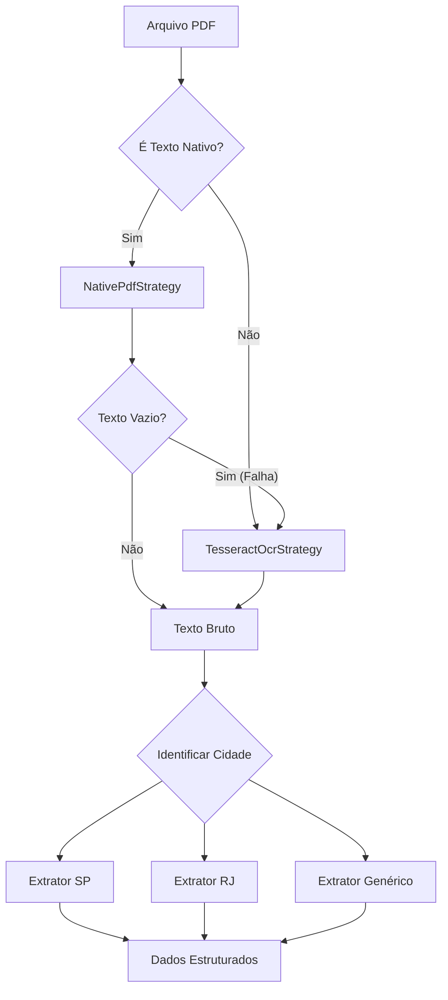

# Relatório de Arquitetura de Software
**Assunto:** Modernização e Escalabilidade de Sistemas de ETL para Documentos Fiscais Desestruturados

## Sumário Executivo

A engenharia de dados, no contexto fiscal brasileiro, enfrenta um desafio de heterogeneidade sem precedentes. A tarefa de processar Notas Fiscais de Serviço Eletrônicas (NFS-e) não se resume a um problema de ingestão de dados convencional, mas configura-se como um problema de **"Domínio Caótico"**, onde a variabilidade é a única constante.

O presente relatório técnico detalha a transição arquitetural de um script de extração linear para um framework orientado a objetos robusto, escalável e auditável. A análise foca na aplicação rigorosa de **Padrões de Projeto (Design Patterns)** clássicos e modernos, adaptados à linguagem Python, para resolver as dores centrais de variação de formato, instabilidade de leitura (OCR vs. Texto) e validação de regras de negócio complexas.

**Objetivo Final:** Fornecer um *blueprint* arquitetural que permita a inclusão de centenas de layouts municipais com impacto marginal zero na estabilidade do núcleo do sistema.

---

## 1. Introdução e Contextualização do Problema

### 1.1 O Cenário da NFS-e e a Falta de Padronização
Diferentemente da Nota Fiscal Eletrônica de mercadorias (NF-e, modelo 55), que possui um esquema XML nacionalmente unificado e rígido, a Nota Fiscal de Serviços (NFS-e) é de competência municipal. No Brasil, com mais de 5.570 municípios, isso resulta em uma fragmentação tecnológica massiva.

Cada prefeitura tem autonomia para contratar seu próprio provedor de solução (ex: Ginfes, Betha, ISSNet, sistemas próprios), o que gera milhares de layouts visuais distintos e formatos de exportação inconsistentes.

Para um sistema de ETL (*Extract, Transform, Load*) que visa ser "Universal", essa realidade impõe barreiras significativas. A "Dor" identificada no projeto atual — a variação de formato e o ruído de dados — não é uma anomalia, mas a natureza intrínseca do domínio. A solução atual, baseada em um pipeline linear com condicionais aninhados (`if/else`) e loops de tentativas, atinge um limite de complexidade ciclomática rapidamente.

### 1.2 Limitações da Arquitetura Linear Atual
A arquitetura vigente, descrita como um script procedural que tenta ler texto e falha para OCR, sofre de **acoplamento rígido (Tight Coupling)**. A lógica de como ler um arquivo (I/O e OCR) está entrelaçada com a lógica de o que extrair (Regras de Negócio e Regex).

As principais vulnerabilidades identificadas são:

* **Fragilidade no Fallback:** A lógica de alternância entre `pdfplumber` e `Tesseract` é *hardcoded*. Adicionar uma terceira opção (ex: uma API de IA Vision) exigiria refatorar o fluxo principal.
* **Dificuldade de Teste:** Testar a lógica de extração de valores requer instanciar todo o pipeline de leitura de PDF, tornando os testes unitários lentos e dependentes de arquivos físicos.
* **Violação do Princípio Aberto/Fechado (OCP):** Para suportar uma nova prefeitura (ex: Marília), é necessário modificar o código fonte existente, introduzindo riscos de regressão para prefeituras já estáveis (ex: Salvador).

### 1.3 Objetivos da Refatoração Arquitetural
A proposta deste relatório é decompor o problema monolítico em componentes ortogonais, utilizando Padrões de Projeto para gerenciar a complexidade. A reestruturação visa atingir:

1.  **Desacoplamento Temporal e Funcional:** Separar a leitura física do arquivo da interpretação lógica dos dados.
2.  **Extensibilidade por Plugins:** Permitir que novos layouts sejam adicionados apenas criando novos arquivos, sem alterar o núcleo do sistema (Kernel).
3.  **Resiliência a Falhas:** Implementar estratégias de fallback e validação que recuperem erros de forma graciosa.

---

## 2. Padrão Strategy: Abstração e Resiliência na Ingestão

A primeira fronteira do sistema é a conversão de um arquivo binário (PDF, Imagem) em texto processável. A solução atual utiliza uma lógica condicional simples: *"Tente A, se der erro, tente B"*. Em uma arquitetura robusta, isso é modelado através do **Strategy Pattern**.

### 2.1 Conceito e Justificativa
O Padrão Strategy define uma família de algoritmos, encapsula cada um deles e os torna intercambiáveis. No contexto deste extrator, o "algoritmo" é o mecanismo de extração de texto bruto.

A aplicação deste padrão permite que o sistema principal (o Contexto) desconheça se o texto foi obtido através de parsing de vetores PDF, OCR local ou uma API em nuvem. O contrato é simples: `Entra Arquivo -> Sai Texto`.

### 2.2 Implementação da Interface de Estratégia
Em Python, a definição do contrato é feita através de Classes Base Abstratas (ABCs).

```python
from abc import ABC, abstractmethod

class TextExtractionStrategy(ABC):
    """
    Interface abstrata para estratégias de extração de texto.
    Garante que qualquer mecanismo de leitura (OCR, Nativo, Cloud)
    siga o mesmo contrato de interação.
    """
    
    @abstractmethod
    def extract(self, file_path: str, **kwargs) -> str:
        """
        Extrai o texto bruto de um arquivo especificado.
        Returns: str: O texto extraído bruto.
        Raises: ExtractionError: Se houver falha irrecuperável.
        """
        pass
```

### 2.3 Estratégias Concretas e Detalhes Técnicos

#### 2.3.1 NativeTextStrategy (Alta Performance)

Esta estratégia é a preferencial. Ferramentas como `pdfplumber` acessam a camada de conteúdo do PDF e extraem os caracteres diretamente.

  * **Vantagens:** Velocidade extrema (milissegundos), precisão de 100% nos caracteres e retenção de metadados espaciais.
  * **Desafios:** PDFs com "texto sujo" (*mojibake*) onde a codificação de fontes está corrompida.

#### 2.3.2 TesseractOCRStrategy (Alta Compatibilidade)

Quando o arquivo é uma imagem (raster), o OCR é mandatório. Esta estratégia encapsula a complexidade do `pytesseract` e do motor Tesseract 4.0+.

  * **Pipeline Interno:**
    1.  **Rasterização:** Converter PDF para imagem (`pdf2image`) em alta resolução (300 DPI).
    2.  **Pré-processamento:** Aplicar binarização e remoção de ruído (*salt-and-pepper*).
    3.  **Execução do OCR:** Chamar o motor com parâmetros configurados (ex: `--psm 6`).

### 2.4 O Padrão Composite para Fallback Robusto

Para resolver a "Tentativa A -\> Tentativa B" sem `if/else`, utilizamos uma variação do padrão Composite/Chain aplicada às estratégias. Criamos uma `FallbackStrategy` que contém uma lista de outras estratégias e itera sobre elas até obter sucesso.



| Característica | Abordagem Atual (Procedural) | Abordagem Proposta (Strategy + Composite) |
| :--- | :--- | :--- |
| **Fluxo de Controle** | `if native_success: ... else: do_ocr()` | `pipeline.extract(file)` (Polimorfismo) |
| **Extensibilidade** | Edição de código fonte arriscada | Adição de nova classe na lista de configuração |
| **Tratamento de Erro** | Disperso e repetitivo | Centralizado na classe Composite |
| **Testabilidade** | Difícil isolar o OCR | Mocking trivial da interface |

# Insights de Segunda Ordem: O Custo do "Hybrid Fallback"

A literatura sugere que a distinção entre "PDF Texto" e "PDF Imagem" nem sempre é binária. Existem PDFs híbridos (texto sobre imagem) ou PDFs onde o texto existe mas é "lixo" (encoding incorreto). Uma implementação avançada da FallbackStrategy não deve apenas checar se o texto é vazio. Ela deve implementar uma Heurística de Qualidade. Se a estratégia nativa retornar texto, mas este texto tiver 40% de caracteres não imprimíveis, a estratégia deve considerar isso uma "falha lógica" e acionar o OCR, mesmo que tecnicamente a extração tenha ocorrido. Esse nível de robustez é impossível de manter em scripts lineares simples.

# Roadmap Sugerido
- Fase 1 (Fundação): Implementar TextExtractionStrategy e o fallback. Isso estanca os erros de leitura imediata.

- Fase 2 (Estrutura): Criar AbstractInvoiceProcessor (Template Method) e migrar a lógica atual para dentro dele.

- Fase 3 (Expansão): Implementar o Registry e começar a separar as lógicas de Salvador e SP em arquivos distintos.

- Fase 4 (Refinamento): Substituir os loops de Regex por Chains of Responsibility progressivamente. 

# Referências Técnicas Integradas
A elaboração deste relatório baseou-se em práticas consolidadas de engenharia de software e documentação técnica de bibliotecas Python.

Padrões GoF em Python

OCR e Processamento de Imagem.   

Pipeline de Dados e ETL.   

Validação e Qualidade de Dados.   

Python Idioms e Metaprogramação.
