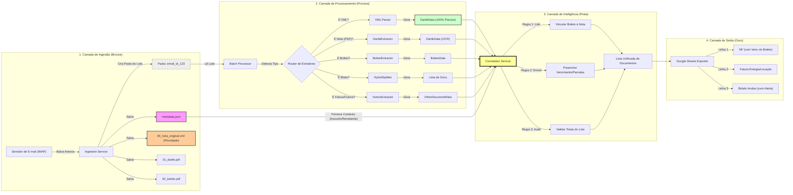

# Refatoração do Scrapper para Processamento em Lote

> ✅ **STATUS: IMPLEMENTADO** (Janeiro 2025)
>
> Este documento descreve o plano de refatoração que foi implementado.
> Para guia de migração, veja `docs/MIGRATION_BATCH_PROCESSING.md`.

## Por que refatorar o scrapper para cruzar dados entre DANFE e Boleto?

1. **Falta de dados:** A DANFE não tem vencimento, mas o Boleto tem.
2. **OCR falho:** O OCR errou o nome do fornecedor, mas o "Remetente do E-mail" está correto.
3. **Auditoria:** O valor da Nota bate com o valor do Boleto?

## **Plano de Implementação** estruturado para essas mudanças:



---

### 1. Camada de Ingestão (Organização e Metadados)

O objetivo aqui é garantir que os arquivos não cheguem "soltos" na pasta temporária, mas sim empacotados com seu contexto.

- **Nova Estrutura de Pastas:**
  Ao baixar os anexos, o ingestor não deve jogar tudo na raiz de `temp/`. Ele deve criar uma subpasta para cada e-mail.

```text
temp/
└── email_20251231_uniqueID/             <-- ID único gerado no download
    ├── metadata.json                    <-- Contexto (Assunto, Remetente, Corpo)
    ├── anexo_01.xml                     <-- PRIORIDADE MÁXIMA (NFe Original)
    ├── anexo_02_danfe.pdf               <-- Representação Visual da Nota
    ├── anexo_03_boleto.pdf              <-- Boleto Bancário
    ├── anexo_04_recibo.pdf              <-- Outros (Locação/Telecom/Recibos)
    └── ignored/                         <-- (Opcional) Lixo segregado
        ├── image001.png                 <-- Assinatura de e-mail
        └── smime.p7s                    <-- Assinatura digital

```

- **Arquivo `metadata.json`:**
  O ingestor deve criar esse arquivo contendo tudo que não está no PDF:
- `email_subject`: (Para sua tabela MVP)
- `email_sender_name`: (Fallback para nome do fornecedor)
- `email_sender_address`: (Para validação de domínio)
- `email_body_text`: (Para buscar CNPJs ou números de pedido no corpo)
- `received_date`: (Data de recebimento real)

---

### 2. Mudança no Processador (Unidade de Trabalho)

Atualmente seu `processor.py` itera sobre arquivos. Ele precisará iterar sobre **Pastas (Lotes)**.

- **De:** `process_file(file_path)`
- **Para:** `process_email_batch(folder_path)`

**Lógica do Novo Processador:**

1. **Carregar Contexto:** Lê o `metadata.json` primeiro.
2. **Inventário:** Lista todos os PDFs da pasta.
3. **Extração Individual:** Roda os extratores atuais (`DanfeExtractor`, `BoletoExtractor`) para cada PDF.

- _Resultado Provisório:_ Temos uma lista de objetos desconexos (1 DANFE, 2 Boletos).

4. **Chamar a "Camada Prata" (Enricher):** Passa essa lista + metadados para a nova etapa de inteligência.

---

### 3. A "Camada Prata" (Cross-Enrichment & Validation)

Aqui é onde a mágica acontece. Você cria um novo serviço, por exemplo, `DocumentCorrelationService`.

**Regras de Negócio para Implementar:**

- **Regra 1: Herança de Dados (Complementação)**
- Se tem DANFE e Boleto na mesma pasta:
- O Boleto herda o `numero_nota` da DANFE (se não conseguiu ler).
- A DANFE herda o `vencimento` do Boleto (ou da primeira parcela, como vimos no caso da Azul).
- Ambos herdam o `numero_pedido` se estiver no Assunto/Corpo do e-mail.

- **Regra 2: Fallback de Identificação (OCR vs Metadados)**
- Se o OCR do fornecedor falhou ou veio vazio:
- Usar `email_sender_name` do metadado.

- Se o CNPJ não foi achado no PDF:
- Procurar CNPJ no `email_body_text`.

- **Regra 3: Validação Cruzada (Auditoria)**
- Somar o valor de todos os Boletos da pasta.
- Comparar com o `valor_total` da DANFE.
- _Novo Campo:_ `status_conciliacao`
- "OK" (Valores batem)
- "DIVERGENTE" (Nota de 10k, Boleto de 5k -> Alerta de parcela faltante)
- "ORFAO" (Só veio boleto, sem nota)

---

### 4. Atualização nos Models (Tabela MVP)

Para refletir isso na saída (Planilha/CSV), precisamos atualizar o `DocumentData` em `core/models.py`:

- **Novos Campos de Contexto:**
- `source_email_subject`: (String)
- `source_email_sender`: (String)

- **Novos Campos de Validação:**
- `batch_id`: (Para agrupar as linhas na planilha visualmente)
- `valor_total_lote`: (Soma dos documentos do email)
- `divergencia_detectada`: (Boolean/String)

---

---

### 5. Adaptação dos Modelos de Dados (Refatoração de `core/models.py`)

Para suportar o enriquecimento de dados e a persistência do contexto do e-mail, as classes de dados precisam ser expandidas.

#### 5.1. Classe Base (`DocumentData`)

Adicionar campos de rastreabilidade para vincular o documento à sua origem (E-mail/Lote).

- `batch_id`: Identificador da pasta/lote de processamento.
- `source_email_subject`: Assunto do e-mail original (para a tabela MVP).
- `source_email_sender`: Remetente do e-mail (usado como fallback de Fornecedor).
- `valor_total_lote`: Soma total dos valores do lote (para validação).
- `status_conciliacao`: Resultado da validação (ex: "OK", "DIVERGENTE", "ORFAO").

#### 5.2. Padronização de Identificadores

Para permitir que o _CorrelationService_ trate NFs e Boletos de forma polimórfica (sem `if/else` excessivos), todos os modelos devem compartilhar um identificador comum.

- **Campo `numero_documento` em `InvoiceData` e `DanfeData`:**
    - Atualmente só existe em `BoletoData` e `OtherDocumentData`.
    - Deve ser adicionado às notas fiscais como um espelho de `numero_nota`.
    - **Regra de Sincronização (`__post_init__`):** Ao preencher `numero_nota`, o `numero_documento` deve ser preenchido automaticamente (e vice-versa).

#### 5.3. Suporte a Parcelamento (`DanfeData`)

Para resolver o caso da Azul (Carrier) onde o vencimento está numa tabela de duplicatas e não num campo único.

- **Novo Campo `parcelas`:** Lista de dicionários/objetos contendo `{numero, vencimento, valor}` de cada parcela encontrada na DANFE.
- **Lógica de Vencimento:** O campo `vencimento` (string única) deve ser preenchido automaticamente com a data da **primeira parcela** da lista, caso o extrator não tenha achado um vencimento único.

#### 5.4. Exemplo de Estrutura Atualizada

```python
@dataclass
class DanfeData(DocumentData):
    # ... campos existentes ...

    # Novos Campos
    numero_documento: Optional[str] = None  # Espelho de numero_nota
    parcelas: List[Dict[str, Any]] = field(default_factory=list) # Detalhe das duplicatas
    chave_acesso: Optional[str] = None

    def __post_init__(self):
        # Garante interoperabilidade com BoletoData
        if self.numero_nota and not self.numero_documento:
            self.numero_documento = self.numero_nota
```

---

### 6. Infraestrutura de Limpeza Automática (Sidecar Pattern)

Como o sistema processará um alto volume de e-mails mensalmente e rodará em ambiente local (Laptop/Docker), o acúmulo de arquivos temporários (`temp/`) representa um risco de performance e estouro de disco.

Para mitigar isso sem adicionar complexidade ao código Python (e sem precisar reiniciar containers manualmente), adotaremos o padrão **Sidecar de Limpeza**.

#### 6.1. O Problema

- Acúmulo de PDFs, XMLs e imagens na pasta `temp/`.
- Risco de travamento do Docker por inodes excessivos.
- Necessidade de manter arquivos recentes (janela de 2 a 3 dias) para auditoria ou reprocessamento em caso de falha.

#### 6.2. A Solução: Container `cleaner`

Um serviço adicional no `docker-compose` que roda paralelo à aplicação. Ele é extremamente leve (Alpine Linux ~5MB) e executa scripts de manutenção em _loop_.

- **Política de Retenção:** Arquivos com mais de **48 horas** (2 dias) de modificação são deletados.
- **Limpeza de Estrutura:** Pastas de lote vazias (`email_id_xxx`) são removidas para não poluir a visualização.
- **Isolamento:** Se o limpador falhar, o processamento não para. Se o processamento travar, a limpeza continua garantindo saúde do disco.

#### 6.3. Implementação no `docker-compose.yml`

```yaml
# Serviço Sidecar para Garbage Collection
cleaner:
    image: alpine:latest
    container_name: scrapper_nfe_cleaner
    depends_on:
        - app
    volumes:
        # Compartilha o MESMO volume temp da aplicação
        - ./temp:/app/temp
    command: >
        sh -c "echo 'Iniciando servico de limpeza...' &&
               while true; do
                 echo '--- [GC] Rodando limpeza de arquivos temporarios (> 48h) ---' &&
                 # 1. Deleta arquivos modificados há mais de 2 dias
                 find /app/temp -type f -mtime +2 -delete &&
                 # 2. Deleta pastas vazias que sobraram
                 find /app/temp -type d -empty -delete &&
                 echo '--- [GC] Limpeza concluida. Dormindo por 24h...' &&
                 sleep 86400;
               done"
    restart: always
```

#### 6.4. Impacto no Desenvolvimento

- **Ingestão:** O código Python não precisa se preocupar em deletar arquivos. Ele apenas cria (`os.makedirs`).
- **Depuração:** O desenvolvedor tem garantia de que qualquer arquivo baixado estará disponível por pelo menos 2 dias para inspeção manual antes de sumir.

---

### Visão Geral da Refatoração

1.  **Ingestão Inteligente** (Pastas organizadas + XMLs). ✅
2.  **Processamento Híbrido** (Router de Extratores). ✅
3.  **Correlação/Inteligência** (Regras de negócio e validação). ✅
4.  **Saída** (Planilha Enriquecida). ✅
5.  **Modelagem de Dados** (Suporte a parcelas e ids espelhados). ✅
6.  **Infraestrutura** (Limpeza automática e saúde do disco). ✅

---

## Arquivos Criados/Modificados na Implementação

### Novos Módulos (core/)

| Arquivo                       | Descrição                                          |
| ----------------------------- | -------------------------------------------------- |
| `core/metadata.py`            | Classe `EmailMetadata` para contexto do e-mail     |
| `core/batch_processor.py`     | Classe `BatchProcessor` para processamento em lote |
| `core/batch_result.py`        | Classes `BatchResult` e `CorrelationResult`        |
| `core/correlation_service.py` | Serviço de correlação entre documentos             |

### Novos Módulos (services/)

| Arquivo                         | Descrição                                    |
| ------------------------------- | -------------------------------------------- |
| `services/__init__.py`          | Exports do módulo services                   |
| `services/ingestion_service.py` | Serviço de ingestão e organização de e-mails |

### Scripts Atualizados

| Arquivo                                | Mudanças                             |
| -------------------------------------- | ------------------------------------ |
| `scripts/validate_extraction_rules.py` | Suporte a modo lote (`--batch-mode`) |
| `scripts/example_batch_processing.py`  | Script de exemplo da nova estrutura  |
| `run_ingestion.py`                     | Usa nova estrutura de lotes          |

### Modelos Atualizados

| Arquivo             | Mudanças                                                         |
| ------------------- | ---------------------------------------------------------------- |
| `core/models.py`    | Campos novos: `batch_id`, `source_email_*`, `status_conciliacao` |
| `core/processor.py` | Removida lógica de NF_CANDIDATE (agora via contexto)             |
| `core/__init__.py`  | Exports atualizados                                              |

### Infraestrutura

| Arquivo                              | Mudanças                                  |
| ------------------------------------ | ----------------------------------------- |
| `docker-compose.yml`                 | Serviço `cleaner` para limpeza automática |
| `docs/MIGRATION_BATCH_PROCESSING.md` | Guia de migração                          |

### Notas sobre NF_CANDIDATE

A lógica de `NF_CANDIDATE` foi **removida** do pipeline principal porque:

- O número da NF agora vem do contexto do e-mail (assunto/corpo)
- O `CorrelationService` herda o número entre documentos do mesmo lote
- Os extratores específicos já extraem o número da NF

O módulo `core/nf_candidate.py` foi mantido apenas para scripts de debug.
